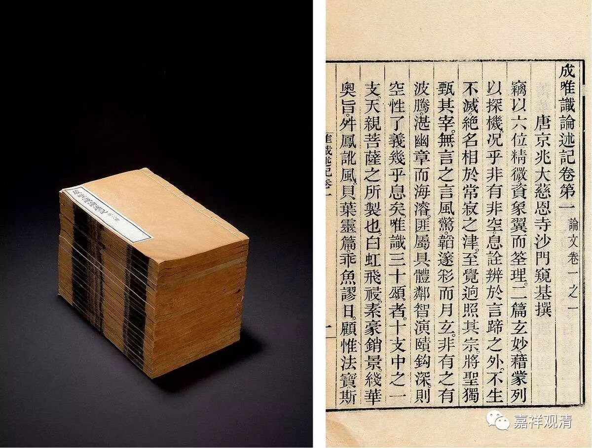

##  《六门教授习定论》007（下） 

但是，唯识派的著作的确是洋洋洒洒，文献太多了，叹为观止！在汉传的文献中， 翻译的 唯识派著作很多， 同时 有部也不少 ， 大概因为四大译师里，三个是出自唯识门下的原因吧；而唯识师通常于有部也很善巧，真谛三藏、玄奘大师都翻译了大量有部著作，义净三藏则大译有部的律藏 ……暂且不表。 藏文的文献里面唯识派著作多不多，好像还不敢说。但是在汉文的文献当中，唯识和有部都是非常非常多的。其实，汉地也失传了很多东西， 真谛法师和义净三藏的译本、讲记 失传的太多了。当然，重要的典籍基本上都还在，这主要和日本 、 高丽 也有点关系 ， 有些经典靠他们保留了下来 。 

其实，唯识派在中国沉寂已经一千多年了，差不多是在唐中晚期以后。再怎么说，也至少是宋代以后沉寂了，有人说在宋代的藏经里面还曾出现过唯识的经典。再以后，唯识的很多经典就找不到了。比如《成唯识论述记》，在汉地已经没有了，在宋代以后你根本就找不到《成唯识论述记》了。然后大家去讲《成唯识论》的时候呢，就全靠自己的聪明才智 ——“我认为这个是什么意思”，那么这里面就出现了很多问题。 

当然，现在的很多情况是，很多人根本就不看《成唯识论述记》 ， 几个原因，一是学养不够，看不懂；一是嫌烦，望洋兴叹 。为什么在民国的时候对《成唯识论》或者说对唯识的研究会有一个大的发展呢？那就要谈到石埭大师 ——杨文会先生。他本来在曾国藩幕府任职，后来跟随曾纪泽出使英国担任外交官，在那里结识了一个日本人叫南条文雄，也是研究佛教的。 

杨文会先生的老家是安徽石埭县。如果我没记错的话，那个县城好像后来建了个水库，结果被淹掉了。杨文会先生就对南条文雄说： “我们互通有无吧！你们那里有的佛教经典也给我们寄点过来。”后来，又加进了一个韩国人，这人的名字我忘了。就是中国、韩国和日本都在收集一些佛教的文献，互通有无，之后杨文会先生就成立了金陵刻经处。 

但是，当时中国很多的论典都没有，哪些呢？《成唯识论述记》、《杂集论述记》、《中论疏》、《百论疏》、《十二门论疏》 ……这些都没有。你看， 中国 佛教 到了 中后期 ， 重要的 著作都 散失 了，那后人要怎么学啊？！那么，金陵刻经处把这些论著从国外翻印过来以后，佛教界突然之间有了这么多东西可以去研究，洋洋洒洒的这么多篇幅。于是又成为一门显学，大家都去学了。包括《因明大疏》也翻印过来了，然后就有人开始研究因明了。你要知道，差不多一千年都没有研究的内容，你一上手随便写一本，那都是开创性的著作啊！像《因明大疏》，篇幅太巨大了，熊十力先生就 编 了一本《因明大疏删注》，把多的内容删掉，剩下的就变成一部作品了。 （ 所以以前的人真是比较容易出 成果 啊！ ） 

中观派的情况也是一样，就像刚才提到的《中论疏》、《百论疏》、《十二门论疏》，都是翻印 日本 找回来的 版本 。吉藏大师的《十二门论疏》，当时汉地没了，是通过日本回来的。所以杨文会先生所做的事情很重要。他建立了金陵刻经处，你们手头这本《六门教授习定论》就是金陵刻经处印的。 

那时候的书一点都不贵，简直 可以说 便宜得要命。你可以去看看胡适先生 、 周作人先生 他们的日记，在日本购买这种旧的藏经 、 各种版本 ，真是便宜得要命。所以他们都经常去日本的小书店淘 古旧 书的，就看你能不能淘得到好书， 有没有眼光， 其实有心就行 （ 还得会忽悠，会砍价 ） 。 

