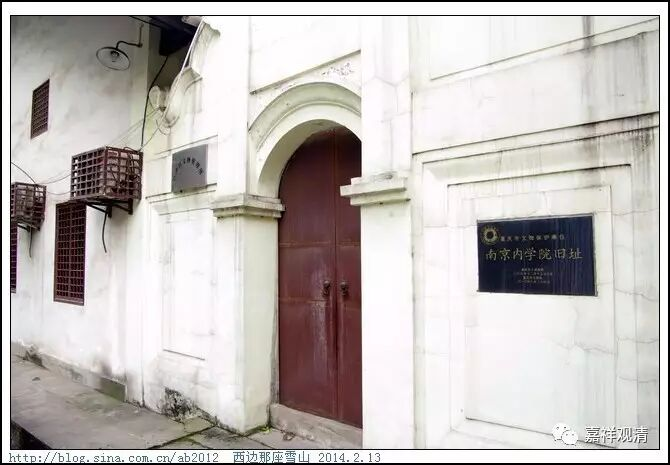

##  江津支那内学院旧址 

##  《六门教授习定论》讲记008（上） 

唐末章疏的流失， 其实不 单纯 是唯识宗和中观宗 的问题 ，天台宗也有这个 情况 。但是呢，天台宗从宋代中晚期开始，就有经典从日本和朝鲜流回中国了，所以他们 散 失的章疏 重现 得比较早。于是，天台宗马上就出现了山家、山外两个派系，他们开展了一些文字的整理工作，算是强心针打得比较早吧。 

那么，唯识和中观的章疏 找 回来了之后呢， 杨仁山居士 先是 捐出自己的宅子， 成立了 “金陵刻经处”，后来又成立了相应的教学机构 ，最早是办僧伽培训班 ， 后来是支那内学院。天台宗的 谛闲法师 是当时 培训班 的教务长 …… 既然唯识的章疏 成建制地出现了 ，大家就 方便 开始学习和研究了， 先做校勘， 句读，再学习、研究 …… 就把王恩洋先生、吕澂先生 ……这些人给培养出来了（其实吕澂先生本来是搞美术的）。 

在那个年代，只要你肯花精力下去，玩什么都可以玩得很出彩。而且，这些大师们能够玩得如此出彩， 同学好友也都是一时的社会精英 —— 梅光羲 ，著有《相宗纲要正编》和《续编》，他 是 民国早年的 财政部部长 ； 胡子芴 ，法尊法师的主要施主，做到 山东省主席 ； 汤芗铭 ，译有宗喀巴大师的《菩萨戒品释》等，北洋海军领袖， 早 在吴佩孚还 做旅长 的时候就已经是海军中将了 ； 陈铭枢，字真如，有和吕澄、熊十力往还信函，讨论唯识义，有《真如做疏所缘缘义》等论稿，是十九路军军长、国民党上将、广东省主席；游侠，后来是国民党海军少将参谋长（中共秘密党员，渡江战役时是江阴要塞起义重要人物）； 欧阳竟无的 大 儿子也是 中山先生的左膀右臂，一度在国民党军界排名第五， 高于蒋介石， 后来因中山舰事件下野，抗战时期为 海军中将， 武汉会战后 被蒋介石 以避战为由 毙掉了 （这里头有很多八卦， 不讲了 ） ……

搞研究的话 ，有 资料 都好说，没书 、缺少资料 就没法 做一些文献 研究 （所以我们要搞图书馆，馆藏要丰富） 。比如明代的时候， 当时僧俗界 也有研究唯识 的一些 著作 ，但是 这些作品 拿到现代来， 基本 没法看 …… 也是可怜，他们没有 可以 依傍的东西，虽然也有《成唯识论》等等， 但是唐人的 注疏 当时都失传了，只能靠自己硬学 。 

