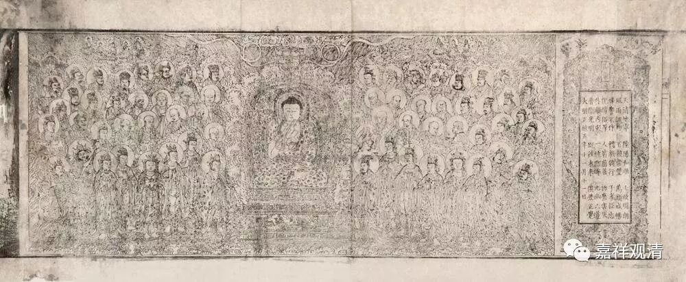

##  《六门教授习定论》008（中） 

**“颂曰：于三乘乐脱，名求解脱人。”**对三乘的法，心乐解脱，名求解脱人。**“二种障全除，”**二种障是什么呢？烦恼障和所知障。这二种障全部断除，**“斯名为解脱。”**这 二种障全部断除才叫解脱 —— 这个就 唯独是趋向于大乘的涅槃了 。但 这里不能单单看字面来理解，要加以解释。 

在 这里呢，这个 “ 二种障 全除 ”应该这样理解：就是二种障中，除 （第） 一个 烦恼障 也可以， 兼带除第二个所知障的一部分也可以，全 除两个也可以。就像我们平时讲的 “自他 并 利 ”，既有 “ 自利 ” ，也有 “ 他利 ” ，也有 “ 自他 并 利 ” 。 

《阿毗达摩杂集论》归敬颂说： “自他并利所依止”，长行解释说：就胜而言，自利，赞 受用身；他利，赞变化身；自他并利，赞自性身。 

这里的 “二种障全除”也要按这个思路来理解，即，“二种障全除，斯名为解脱”的解脱，包括三乘解脱： 1 、唯除烦恼障而得的解脱——声闻阿罗汉； 2 、断除烦恼障及部分所知障的解脱——独觉阿罗汉； 3 、断除二种障的解脱——究竟佛果。（ 其中 ，单独解决所知障的这种情况是没有的。 ） 为什么这么说呢？因为这里既然 前面 讲了是**“于三乘乐脱”**，就不能说 本论只承认 “断除二障” 的大乘究竟解脱 这一种 。这 “ 二种障 ” ，有除一种的， 有除一种半的， 有除两种的，就是类似 “ 小于等于 ” 或 “ 大于等于 ” 这样的意思 。 

在玄奘法师的翻译文献当中经常有这种情况出现。比如，他经常会用 “已”这个字，我们一般会认为“已”的意思是从什么什么以来，或者小于等于。但有时候他的意思是小于等于，有时候又是小于，再有时候就是等于。所以你真的要看前后的文字，才知道是什么意思。比如说，讲到四种果位的时候，讲二果所断的烦恼，用的是“六品已”，其实所指的只是断 除欲界 第六品 烦恼 。二果向呢？也用了 “已”字——“五品已”，指的却是断除 欲界 五品以下的烦恼，就是小于等于五的意思。所以这两个 “已”的 用法，一个是 “ 等于 ” ，一个却是 “ 小于等于 ” 。 

本 论此处 也差不多是这个意思，虽然它说的是 “全除”，实际上指的是 “ 小于等于 ” 。 

