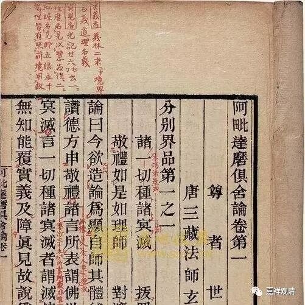

##  《六门教授习定论》008（下） 

**“应知执受识，”**一般来讲， “执受识”就是阿赖耶识，而这里是把“执受”当成动词了——这个我们后面再讲。**“是二障体性。”**那么，二障的体性是阿赖耶识吗？不是 这个意思 。二障的体性，是烦恼障和所知障。**“惑种一切种，”“惑种（障）”**就是烦恼障 ，**“一切种（障）”**就是 所知障。《俱舍论》里面也讲了， “ 诸 一切种诸 冥灭 ”，就是“ 诸 一切种冥 ”和“诸冥”。这里的第一个“诸”字，一直要管到后面一句。“冥”就是暗的意思，“一切种冥”就是非染污无明或者不染污无明，就相当于所知障。“诸冥”，就是染污无明。这个“诸冥”就是烦恼障，就是“惑”，而“一切种冥”就是所知障，就是烦恼障的习气。 

我们如果不看《六门教授习定论》的话，会觉得唯识所讲的烦恼障和烦恼障的习气和中观的讲法是不一样的。但是如果看《六门教授习定论》的话，这个说法倒是和 应成 中观一样的。这里说：烦恼障就是烦恼，所知障是什么呢？就是烦恼障的习气。所以，这个说法倒是和中观一模一样的。唯识主要的麻烦在于各种说法太多了，但至少 这里 这种说法也是被中观所采用的。 

**“惑种一切种，由能缚二人。 ”**“惑种 （障） ”和“一切种 （障） ” ——烦恼障和所知障， 这两个 “ 能 缚二人 ”。这里的“二人”是指两类人。所以你看，这种说法又完全是和中观相应的。仅仅解决了烦恼障的人是谁呢？是声闻罗汉。烦恼障和所知障都解决的人是谁？就是佛，或者我们也可以说，菩萨是致力于烦恼障和所知障两个都解决的 ，其中不共的对治对象是 所知障 。所以这里说，惑种（烦恼障）和一切种（所知障）缚二类人 ——大乘人和小乘人。 

**“已除烦恼障，”**已经断除了烦恼障的，但是烦恼障的习气未蠲除 ——**“习气未蠲除，此为声闻乘。”**烦恼障断了，所知障没有断除，这个就是声闻罗汉。**“余唯佛能断，”**这里的 “余”指的就是声闻罗汉所没有断除的，是什么呢？就是烦恼障的习气，就是所知障。这个谁能断除呢？**“余唯佛能断”**，就是所知障唯佛能断 尽 。这个说法和我们中观讲的是一样的吧？看起来唯识的这部教典中的 二障的 说法是很接近 应成 中观的，或者说 应成 中观也是采用这个说法的。其实还是这个情况，应该说是唯识的说法太多了，各种各样的都有。你看，中观就比较轻松 ——那么多说法，我取一个，能说圆了 的 就行，我们就接受，就采用。 

