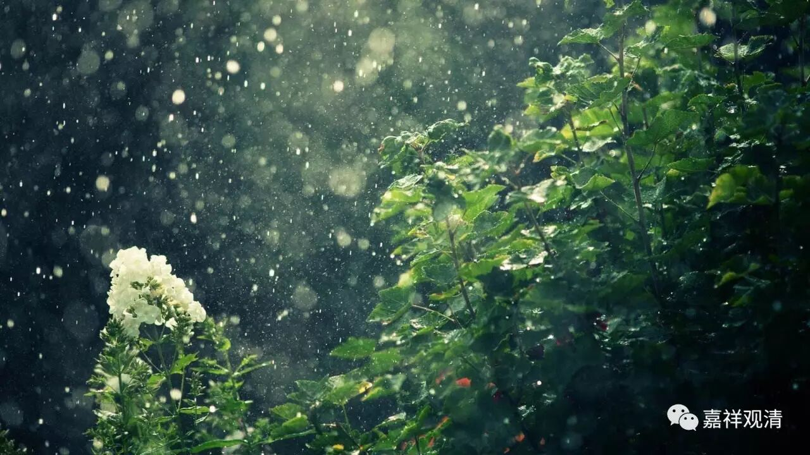

##  《六门教授习定论》讲记016（上） 

比如说，《大智度论》里面就有一个故事，讲一个仙人喜欢在山里面打坐，禅定的功夫非常好，肯定是获得色界以上的禅定。当然他也总不可能一直在山里面打坐，也还要出来走走或者逛逛的。结果正好天上下雨，他吧嗒摔了个大马趴，就很不爽： “好你个龙王啊！竟然下雨，让我摔了一跤。”然后他就叫嚷：“不许下雨了！”因为他功夫太高了，立时就不下雨了，而且整个国界里面都不下雨了。那还了得啊！那就不行了。 

说个我碰到的故事：我们 也遇到过类似的 情况，当然 也可能是巧合，但也是算得上一个故事了。 有一年长江发大水，九华山下 也 全部都是水，农 田、道路 都被水漫了。 但 后来，九华山就不下雨了，怎么都不下雨。我当时正住在九华山的山顶上，你如果在山顶住过就知道了， 老是不下雨， 山顶没有 存 水 ， 是非常麻烦的。当时，山顶的 几个水源 全枯了，还不下雨 的话，生活用水会成问题 。 

某个汕头，有个住山的 老和尚已经渴了好久了，最后就说： “不行！我还就不相信护法就不护我们了， 修行人 水都没吃还了得 ？！ ”他就开始念经求雨，一直在那里念经，可是雨还是没有下。他就跟护法犟上了：“不下雨？你这护法不保佑我们出家人啦？你不下雨，我就不睡觉了。”然后他天天都在那儿念 ，晚上还点了蜡烛在那儿念，真不睡觉 。 

当时有另外一位出家人就跑过来说： “哎呀！ 某某 师父啊，这样吧，我来帮您挑水。 ”其实在山下面 稍 远的地方 有一个小水源 还是有一些水的。 “不行！我要自己求雨 ！ ”后来，我和其他几位师父也去 劝他 ： “师父啊，山下面在发大水，是不能求雨的了。”“不行，我就不相信，护法还不护修行人了？！”

说实在的， 有可能，住山的 老和尚还是有点本事的 ，或者说护法还是蛮灵的 。他念着念着，真的乌云来了， 但只是 下了几滴雨， 很快 又停了， 其实下的那点雨，也 就是 让 地上稍微湿了一点 而已 。我们都想， “ 这老和尚还是有点面子啊。 ” 但是，虽然是有点面子，也就是山上湿了一点，这点水是根本不够吃的 ，一点都没积起来 。怎么办呢？于是，老朱就挑了一桶水过去，对老和尚说： “哎呀！法师啊，真的下雨了！下雨了！” 其他话也没多说。这 相当于 暗示老和尚， 承认 “你念经的确是有本事的，我们都看到了”，同时又帮他把水挑上 。老和尚挣来了面子， 第二天就开始 正常 吃饭 、睡觉 了。这个插曲是当代求雨的故事。 

回到前面仙人的故事，他是对龙王说不许下雨，连带整个国界里面都没有雨了。皇宫里面也没雨，那就麻烦了。国王想着该怎么办，就贴榜公告看看谁能求雨。结果有个妓女就站出来说： “我来。”国王就问：“你有啥本事求雨啊？”那个妓女说：“你看我的吧！我不仅可以求到雨，还可以骑在这个仙人的脑袋上回来。你信不信？”国王很是怀疑：“你有这么大的本事吗？”大家都知道那个仙人是很厉害的，根本惹不起。 

这个妓女呢，就把自己化妆成一个修行人的样子，然后跑去山里面打坐修行，并且慢慢地接近这个仙人。接近了以后，这个妓女就开始要这要那，最后这个仙人就 Hold不住了，连禅定也失去了。一旦禅定失去了以后，贪爱等等全都冒出来了。这个妓女就开始各种“作”：“我要下山！”仙人说：“好好好！陪你下山，陪你下山。”“我累了！”仙人又说：“好好好!你骑我,你骑我吧。”于是，妓女就骑着仙人回到皇宫去了。因为仙人的禅定已经退失，功夫没有了，这个国家又开始下雨了。 

所以，那些自诩已经证得初、二、三禅的人，还在说什么准备结婚，姑且不说后面有没有退失禅定，实际上都没有真正地对欲界的欲生起厌离心，那修成的到底是不是初、二、三禅啊？！当然你可以检查禅支，但是如果你对什么是寻伺等等的禅支都不理解，那你所生起的、你检查禅支的这些理论，到底对不对呢？禅支的理论本身是对的，可是你自己对于禅支的理论，究竟了解不了解呢？ 

