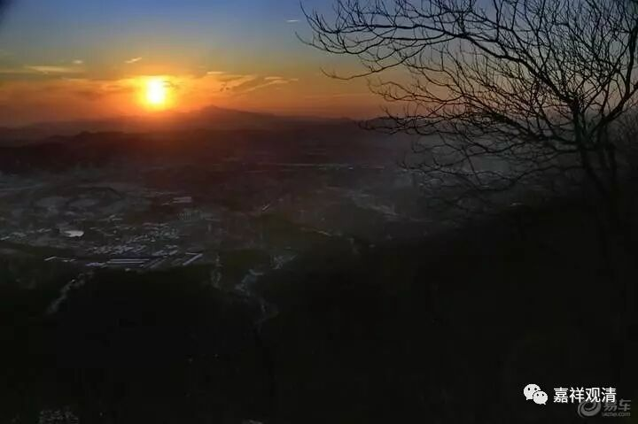

##  《六门教授习定论》讲记019（上） 

**“云何调顺？谓种种相令心散乱，所谓色、声、香、味、触相，及贪、嗔、痴、男、女等相，故彼先应取彼诸相为过患想。”**这个是先了解色、声、香、味、触、贪、嗔、痴、男、女这些的过患，然后呢，**“由如是想增上力故，于彼诸相折挫其心，不令流散，故名调顺。”**由你自己的决择进行防范，再把这些相折挫。就是你要先知道哪些东西是不好的，这些不好的东西就不去想了，不去考虑了。也就是说，是有点防患意识。 第五住心。 

**“云何寂静？谓有种种欲恚害”**（就是我们通常讲的贪、嗔、痴）**等诸恶寻思， ”**不该做的这些事情，**“贪欲盖等诸随烦恼，令心扰动，”**贪，在这里说是随烦恼 ,随着其他的烦恼。在《集论》里面有说到，所有的烦恼也可以叫随烦恼，所有这里用了 “ 随烦恼 ” 的名词也是可以的。**“故彼先应取彼诸法为过患想。”**知道这些**“恶寻思”**和**“随烦恼”**都是不对的，有所了解之后就起加行。**“由如是想增上力故，于诸寻思及随烦恼，止息其心，不令流散，故名寂静。”**前面的住心是单单的安住比较多，这个住心呢，是在安住之前还有一个了解通达并且背离厌弃的背景，放掉了一些不需要的东西。 第六住心。 

**“云何名为最极寂静？谓失念故，”**还是一样，由于失念，就是忘失了你的所缘境，失去了你的正念的对境。**“即彼二种暂现行时，随所生起诸恶寻思及随烦恼，能不忍受，寻即断灭、除遣、变吐，是故名为最极寂静。”**那么，在这个时候你只要稍微生起一点点 失念 ，就马上能够抓回来，这个就叫**“最极寂静”**。就是马上就想干掉它，把不对的恶寻思、错误的散乱等等**“断灭、除遣、变吐”**，就不要，就断除，这个就是**“最极寂静”**。 第七住心。 

**“云何名为专注一趣？”**就是专注在一个境上，基本上就在一个境 、一类境 上不动了，但是它是有加行的，这个叫功用位。**“谓有加行、有功用，无缺无间三摩地相续而住，是故名为专注一趣。”（**所以，窥基大师说并不是所有的住心都是三摩地，也是有原因的。这里的文字上是明显地说**“无缺无间三摩地”**嘛 ，那就是说，之前的还是 三摩地 “有间有缺”咯 。 ）**“相续而住，是故名为专注一趣。”**这个时候就叫**“专注一趣”**。但是它是有加行的、有功用的，而它的三摩地本身是没有间缺的，没有中断的。就是在上座以后，这一座的心是完全连在一起的，中间完全没有中断的。如果是 第七住心**“最极寂静”**的话，中间就有中断，然后马上能够发现再拉回来，而 第八住心**“专注一趣”**呢，它是没有中断的，但是它是有加行的、有功用的，这个和后面第九住心又不一样。 

第九住心就是无功用的、任运的。**“云何等持？谓数修、数习、数多修习**（已经很多次了，习惯了）**为因缘故，得无加行、无功用任运转道。 ”**就是上座以后不用刻意的，或者是不刻意地，就像我们现在走路一样，不用去想怎么走路就随便走了。**“由是因缘，不由加行、不由功用，心三摩地任运相续，无散乱转，故名等持。”**所以说这个就是**“等持”**。 

按照宗喀巴大师的理解，这个 “等持”只能叫假名等持，还不是真的“等持”。而按照窥基大师的理解呢，这个第九住心就算是真的“等持”了，就是“等持”、“等引”都可以讲。 

