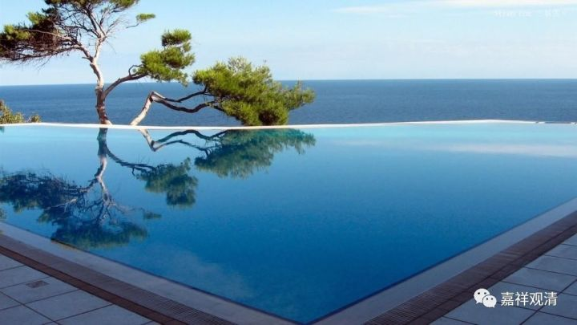

##  《六门教授习定论》020（中） 

我们来看其中的文字。**“此中坚执不散，”**就是指**“内住”**，或者本论所说的**“最初住”**，**“是励力荷负作意，初用功力而荷负故。”**最初用功、用力。 “力”差不多就是有功用的意思。另外一个“励”就是励力、努力、加行的意思。 

**“次正流等六种不散，”**依本论，就是从第二住心到第七住心。本论的颂文当中讲**“正流”**，所以是**“正流等六种不散”**。按照本论的解释，就是从**“正念住”**到**“降伏住”**，这六个是**“有间荷负作意”**。**“中间数有乱心起故。”**有间缺，就是比如用一根线代表我们打坐的时间的话，在这个中间，它是有间断的。而从第八住心开始，它就是没间断的。 

**“无间加行，”**就是专心一境，或者在本论的颂文当中，叫做**“功用住”**。在本论的这个释文当中是说 “无间”。那么，这就对应第八住心，**“是有功用行荷负作意。”**如果完整地讲的话，应该是 “无间缺、有功用”，对吧？第八住心和第九住心都应该叫“无间缺”的，那么“无间缺”这个词就不讲了。所以，第九住心应该叫“无功用、无间缺荷负作意”。 

**“入串习道， ”**通过串习，非常熟悉了以后，等持心 “无功用、无间缺”运转作意，或者按照这里的说法，是**“无功用行荷负作意”**。 

**“如是摄已，谓一六二，”**实际上应该是 “一六一一”，**“应知即是四种作意。”**那这里就是配四种作意。 

下面我们来看这个表格。《瑜伽师地论》里面的 “九住心”是这么对应“四种作意”的。 

##  序号 

| 

##  《六门教授习定论》 

| 

##  《瑜伽师地论》卷三十   
  
---|---|---  
1  | 

##  最初住 

| 

##  励力荷负作意 

| 

##  力励运转作意 

| 

##  内住 

| 

##  听闻力   
  
2  | 

##  正念住 

| 

##  有间荷负作意 

| 

##  等住 

| 

##  思维力   
  
3  | 

##  覆审住 

| 

##  有间阙运转作意 

| 

##  安住 

| 

##  忆念力   
  
4  | 

##  后别住 

| 

##  近住   
  
5  | 

##  调柔住 

| 

##  调顺 

| 

##  正知力   
  
6  | 

##  寂静住 

| 

##  寂静   
  
7  | 

##  降伏住 

| 

##  最极寂静 

| 

##  精进力   
  
8  | 

##  功用住 

| 

##  有功用荷负作意 

| 

##  无间阙运转作意 

| 

##  专注一趣   
  
9  | 

##  任运住 

| 

##  无功用荷负作意 

| 

##  无功用运转作意 

| 

##  等持 

| 

##  串习力   
  
这个九住心和四种作意的内容在《瑜伽师地论》的第三十卷也有，但《瑜伽》是前面两住心对应的是 “力励运转作意”；后面五住心对应的是“有间阙运转作意”；第八住心，对应的是“无间阙运转作意”；第九住心对应的是“无功用运转作意”，是“二五一一”。 

