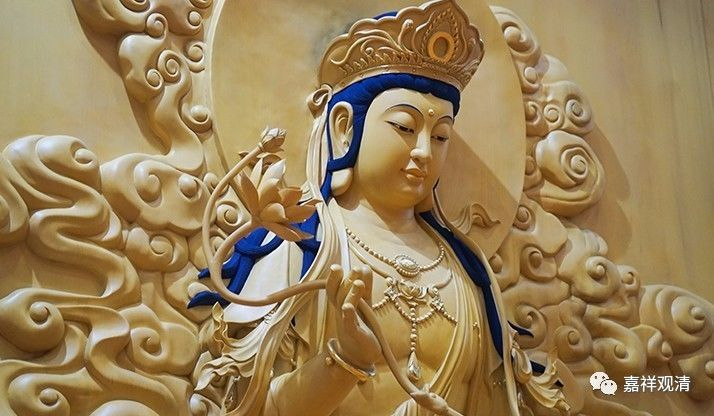

##  《六门教授习定论》026（下） 

所以， 专修禅定的阶段， 就需要有**“根律仪”**——**“善护诸根等”**，眼耳鼻舌身，包括意根也是的 —— 不要多想 、不要瞎想 。 

**“四净因应知。”**一共有这四种净因。在解释里面说，这就是戒律清净的四种因。 

**“正行于境界，”**就是依靠这些正行，这个 “行”字好像也不需要翻译，本身就很好了。 

**“与所依相扶，”**相对应、相扶助。 

**“于善事勤修，能除诸过失。最初得作意，次得世间净，更增出世住，三定招三界。”**这个是相对应于前面的初、中、后来讲的，我们到后面再讲。就是前面的一个外境，一个上境，一个出世间住 ——内心。 

好，下面看释文。 

**“释曰：住资粮者，”**就是修定的资粮，**“谓戒即是无边功德所依止处，”**就是戒。如果按照 像 《广论》的习惯，可能我们在这里可以这样解释：**“谓戒”**的这个戒是以殊胜立名，实际上是可以代表其他的。比如说，在《广论》里面讲归依的时候，有讲到归依的学处这一段，就讲不杀生、不恼害众生，也是以此一部分内容来指代整个的教法。另外，《瑜伽师地论》在讲自他圆满的时候， “人、生中、根具，业未倒、信处”，讲到“信处”的时候就讲要信戒——信毗奈耶，但是，也应该把它解释为相信整个的佛法，而不单单是信戒。所以在这里，可以把戒解释为代表。当然，如果咬文嚼字的话，那就是戒了。**“谓戒即是无边功德所依止处，必先住戒，”**后面其他所有的功德都是依它而起。 

如果按照我们刚才所念的《阿摩昼经》来看， 可以更清楚。 它前面讲的是居士，听法了以后，就有善法欲，然后出家 。如果按照《沙门果经》也是一样的，也是先有善法欲，然后出家，再证得一个一个的沙门果， 所以这个戒是**“无边功德所依之处”**，所以**“必先住戒”**，首先要有戒律的依靠。这个当然是以出家的来比喻，其实在家的也是一样。至少是首先要有归依戒吧，然后五戒的部分，能够做到的就要尽量都做到。 

其实在《瑜伽师地论》当中，讲到戒的时候，特别提到了微小戒，连微小戒都要防护不犯。那么，什么是微小戒呢？这里面有没有讲法呢？微小戒就是可以忏悔的，跟帕绷喀大师的意思是一样的。即使对于微小戒，也要心生防护，要很小心、很仔细地不要犯。 

