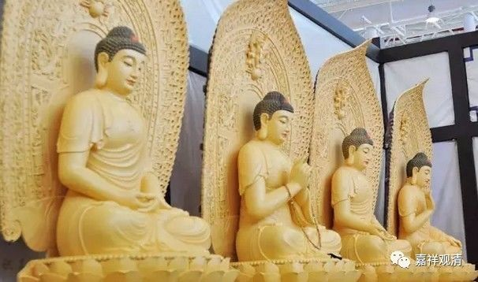

##  《六门教授习定论》讲记027（上） 

**“必先住戒，戒行清净，无有缺犯。”**其实**“无有缺犯”**和 “无有犯”的意思是不一样的。“缺”是没有，就是这个戒已经没有了。“犯”是你的这个戒还不至于没有。如果有兴趣的话可以看看《瑜伽师地论》，**“无有缺犯”**这里面是 有点 复杂的。 

**“若求戒净，有四种因。”**你想要戒律清净，那这四种因都会对此有帮助。其实真正来看，很多都是戒律里面的，包括吃饭也是戒律里面的，吃饭就包括在行、住、坐、卧里面嘛。悎寤瑜伽，这个我不知道是不是戒律里面的，好像不是，但是这个肯定跟修禅定有关。 

当时，释迦牟尼佛知道目犍连在那里打坐，不睡觉，连着打坐了六天，已经累得不行了，还是不肯睡觉。释迦牟尼佛就对他说： “你要修打坐，当然很好，但是现在也可以起来走一走，脸上洒一点水，边上的人少的话，也可以大声念经，或者去思维法义等等。最后实在不行，你可以睡会儿。 ” 释迦牟尼佛讲完以后，到第七天，目犍连就成罗汉了。他是七天成罗汉的，舍利弗是 又过了 七天成罗汉的。 

他们俩当时带着他们的弟子，二百五十个人，去见释迦牟尼佛，在碰到释迦牟尼佛之前， 舍利弗、目犍连 都已经证得初果了。 舍利弗是先见到马胜比丘的，然后马胜比丘对他讲了三遍缘起偈 ——“诸法因缘生， 如来说是因 ； 法灭亦如是 ， 是大沙门 说 ”。说了三遍，舍利弗就证得初果了。后来，舍利弗就把缘起偈带给目犍连，目犍连也证得了初果。 （ 奇怪的是，目犍连为什么不把舍利弗当作根本上师，而是把马胜比丘当成根本上师呢？这个有点奇怪哦， 难道 带句话过来就可以算了吗？开个玩笑。 ） 

、 

后来他们就把他们的弟子集合起来，带到释迦牟尼佛那里去学习。释迦牟尼佛给他们讲了经，讲完以后，就出现一件事情 ——他们两个人还是初果，而他们的弟子都已经是四果了。这个时候，估计会很胸闷——当然这个是我自己的不太好的理解哦。自己的兄弟们都已经解决问题了，而自己还没有解决。所以目犍连就一直很用功，连着六天没睡觉，就实在 睏得 不行了。然后，释迦牟尼佛在那个时候对他讲了讲，应该如何修行，到第七天目犍连就证果了。 

……

