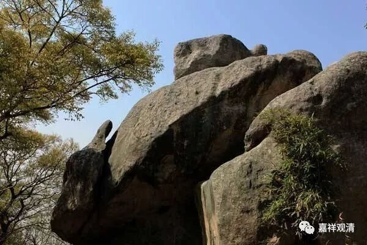

##  《六门教授习定论》027（下） 

《瑜伽师地论》里面就讲得太广了，好多地方都是在讲同一件事情，我们来看看吧。先看第二十一卷是怎么讲的。**“谓即依此尸罗律仪，”**在此戒律之上，**“守护正念，修常委念，”**常就是恒常，委就是委重 ——这是玄奘法师翻译的一个习惯。恒常、委重， 就是 一直都很重视，或者一直专注在这上面。我也不知道怎么翻译好，不知道该用哪个词，用 “殷 勤 ”这个词行不行？《瑜伽师地论》经常有这个词“修常委行”，就是恒常地、不间断地、殷勤地修行。**“以念防心，”**用正念防护其心，**“行平等位。”**如果用心电图来比喻的话，心是贪嗔的话，就有很多很 陡峭 的峰谷，而这里的平等 ， 则应该是平静的，是指有这样的心的时候。 

**“眼见色已，而不取相，不取随好。”**看见就当没看见一样，你不要太贪爱 “ 它的好处在哪里 ”、“ 它的殊胜的地方在哪里 ”…… 不要取殊胜的相，不要取好的地方，要不然你就跟它走了。我以前有个朋友的朋友是复旦的一朋克，晚上无聊的时候，一开始在复旦的校门口蹲着看美女。有美女过去的时候，就 “眼见色已，取其相，取其随好”， 心 就跟着走了。后来在复旦看惯了以后，觉得没劲，没事的时候就坐个车去淮海路看美女 ……世间人 真是无聊啊！ 

**“恐依是处，由不修习眼根律仪防护而住，其心漏泄所有贪忧恶不善法。”**这些不善法就会增长，就跟着走了嘛。那么眼根是这样，其他诸根也是一样。 

**“故即于彼修律仪行，”**在这方面挡住，什么都不能做，**“防护眼根，依于眼根修律仪行。”**在眼根上也是这样，有不看的，或者看了以后就过去算了，如果跟着过去就会想太多，以后打坐的里面都会出现，然后你还会跟过去。比如说现在打坐光是观察呼吸，忽然有一个念出来，你就会跟很久的，再回来，再跟出去，有时候还会想 “要不就跟下去玩玩吧”。 

接下去，其他诸根也是一样。**“如是行者，耳闻声已……”**听的也是一样，一听到有人叫你的名字，头就转过去了。我也已经习惯别人叫我 “法师”了，一听到有人叫“法师”，我就转过头去了。 有一次在普陀山，正在岩石上看风景 ……老听到有人叫我“ 啊观清法师 ”，扭头又找不到人。继续逛， 突然恍然大悟 ——其实他们是在用方言说“二龟听法石”，我给听成“啊观清法师”，还以为自己名气太大了粉丝太多了……

