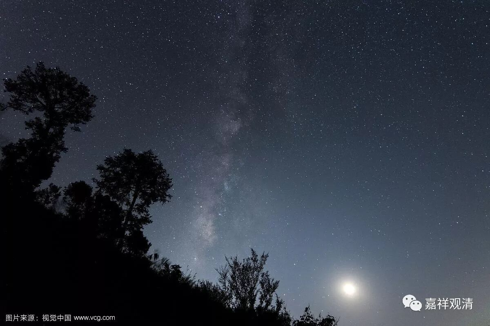

##  《六门教授习定论》031（中） 

然后呢，**“为除彼故，”**为了去除昏沉睡眠的情况，**“于此正法听闻受持，以大音声若读、若诵，”**打坐 坐不住 了， 累了困了，没带 “红牛”， 想要睡觉了，就大声念经。**“为他开示，思维其义，称量观察。”**讲经、闻法，思维法义 …… 南传的山林派就是这样的，晚上大家集中在一起，你就算困得不行了，老师还得要给你讲经，就是要控制你这个方面，不要让你睡觉。对老师来说，他是大声说，对你来说，就是拼命听 （和尚何苦为难和尚 ……本是同根生，相煎何太急……半夜还不让人睡觉，好辛苦……哦，不，精进！） 。 

**“或观方隅，或瞻星月诸宿道度，”**这个好像蛮无聊的嘛，就是或起来看看周围，打坐已经很困了，就起来走走看看。或者看看天象， “ 夜观天象 ”大概 就是这样来的，没事看看星辰是怎么运行的，好无聊啊！ 这是科学家啊！夜观天象，看看明天早上吃油条还是吃煎饼 ……

再有什么呢？**“或以冷水洗洒面目。”**洗洗脸，用冷水洒，清醒一下。 

**“由是昏沉睡眠缠盖未生不生，”**昏沉睡眠，说经过这样， 没有生起的就不生，**“已生除遣。”**已经生起的也没了（吗？ 这么容易就除遣了啊 ） ！ 

**“如是方便，从顺障法净修其心。”**这些都是方便法。实在不行的话，怎么办呢？这里面没有说，但是 阿含 经里面其实还是说了。当时释迦牟尼佛就跟目犍连说： “ …… 如果实在这些都不行了，那你就睡会儿吧。 ” （为什么要把最重要的话省掉？还好我看书多 ……还是老佛爷贴心啊！） 

