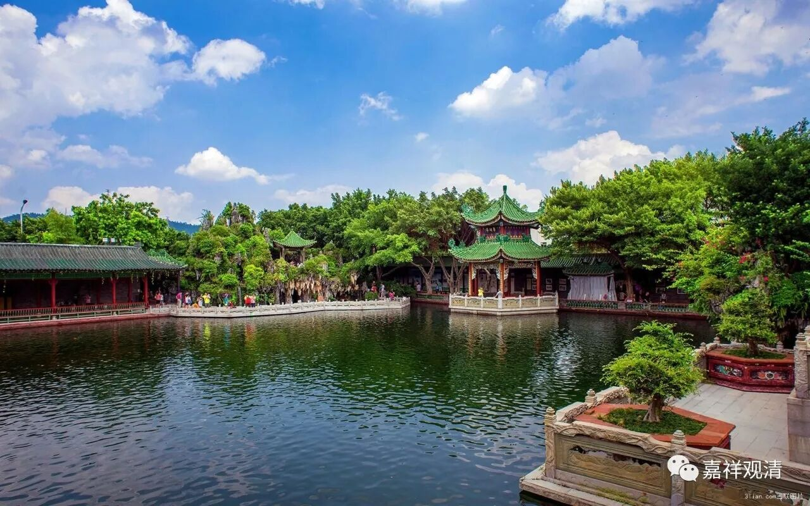

##  《菩提速道》讲记001 

诸佛正法贤圣三宝尊，从今直至菩提永皈依， 

我以所修施等诸资粮，为利有情故愿大觉成 。 

《般若波罗蜜多心经》 

观自在菩萨，行深般若波罗蜜多时，照见五蕴皆空，度一切苦厄。舍利子，色不异空，空不异色，色即是空，空即是色，受想行识亦复如是。舍利子，是诸法空相，不生不灭，不垢不净，不增不减。是故空中无色，无受想行识，无眼耳鼻舌身意，无色声香味触法，无眼界乃至无意识界，无无明亦无无明尽，乃至无老死，亦无老死尽，无苦集灭道，无智亦无得 ， 以无所得故 。 菩提萨埵 ， 依般若波罗蜜多故，心无挂碍；无挂碍故，无有恐怖，远离颠倒梦想，究竟涅槃。三世诸佛 ， 依般若波罗蜜多故，得阿耨多罗三藐三菩提。故知般若波罗蜜多是大神咒，是大明咒，是无上咒，是无等等咒，能除一切苦，真实不虚。故说般若波罗蜜多咒，即说咒曰：揭谛揭谛 ， 波罗揭谛 ， 波罗僧揭谛 ， 菩提萨婆诃 。 

遍地香涂鲜妙杂花敷，须弥四洲日月顶庄严， 

以此所缘诸佛佛土献，愿诸众生清净佛刹行。 

伊当，古如，日阿那，曼扎拉，冈尼日雅达雅弥。 

讲课 之前 ， 我们先念一下 《兜率百尊深 道 上师瑜伽法》 。 

从于兜率天众依怙心，涌出新酪累累净白云， 

遍知法王善慧贤名称，愿同法子于此降来临。 

面前空中狮子莲月座，至尊本师熙怡晏然居， 

我心皈信无上胜福田，弘宣圣教百劫愿久存。 

遍了所知正量善慧意，贤士耳根庄严妙善语， 

具德名称光耀端肃身，见闻忆念得益我敬礼。 

夺意功德之水种种花，妙味烧香灯明涂香等， 

实设意化供云大海聚，上师殊胜福田至诚敬。 

我从无始时来广积集，身语意三所做众罪等， 

三部律仪违越诸品缠，至心痛悔猛励各各忏。 

浊世多闻勤修恒精进，有暇圆满大义离八风， 

依怙创修广大利益行，我等至心系念作随喜。 

具德无上最胜诸师尊，法身虚空遍布悲智云， 

应机调伏所化之大地，深广正法甘霖愿普兴。 

尽我所有积集诸善根，兴隆正法饶益遍有情， 

尤愿法王至尊宗喀巴，圣教心要恒常普光映。 

无缘大悲宝藏观世音，无垢大智胜王妙吉祥， 

摧伏魔军无余秘密主，雪域智者顶严宗喀巴， 

善慧贤称足下作白启。 

下面念《略修道次第》 。 

能成众德之基具恩师，如理依止道之初步正， 

善观察 已 恒时奋殷勤，作大恭敬依止求加持。 

偶一获此圆满有暇身，最极难得大事了知竟， 

日夜恒时抉择心坚固，生起相续不断求加持。 

身命动摇犹如水中泡，迅疾灭坏必死应思惟， 

死已如影随行黑白业，引还后果决定获不异， 

如是知 已 一切诸恶业，细而又细亦复令断离， 

众善资粮遍尽能修成，恒常具足殷勤求加持。 

受用无厌一切众苦门，无可保信世间诸圆满， 

见过患已于彼解脱乐，大希求心生起求加持， 

即此清净出离慧引起，正知正见大大不放逸， 

圣教根本别别解脱戒，坚持修行能作求加持。 

如我沦落 有海 固如是，父母众生陷溺亦如之， 

见 已 解脱诸趣担负荷，发起菩提胜心求加持， 

仅唯发心不受三聚戒，或受无习亦难成菩提， 

能善见 已 佛子诸律仪，起大精进受学求加持。 

心趋倒境散乱能作止，且于正义如理起寻思， 

由是引发止观双运道，速疾相续生起求加持。 

共同道熟密器成就已，一切乘中最胜金刚乘， 

堪能士夫契入正习修，决定稳速入道求加持。 

此时二种悉地成就基，宣说清净誓语三昧耶， 

不假造作定解获得已，胜于生命守护求加持。 

此后密部心要二次第，凡诸津要 知 已务精进， 

勤行四座瑜伽无懈怠，准如师教修行求加持。 

如此妙道导引善知识，如理修行善友坚固住， 

一切内外魔障中断类，随即消灭清净求加持。 

一切生中不离清净师，诸法资财受用悉具备， 

地道功德一切圆满已，持金刚位唯愿速疾登。 

我们 已经连续两三 年了吧 ？ 都是在十一的时候讲道次第 。 去年十一期间 ， 因为洛桑 格西在寺院 灌顶，我们就没有讲道次第 。算上之前的， 这应该 是 第三次讲道次第了。那么 ， 我们以后十一期间都安排道次第的传讲吧 ！ 

前年我们已经传过《广论》了，而 这部 《菩提 速道 》是 我们自己印刷的。我很伤心啊 ！居 然有人说不是我 们 印的，说是另外一个大牌组织印的 —— 所以我们现在的牌子还是不够硬啊 ！ 不过只要有流通就好 ……

我们手上的《菩提速道》的版本是缘宗法师 （又名妙方法师） 翻译的 。 现在汉地 的《 广论 》 学习小组越来越多了，又多了 《 略论 》 学习小组 ， 是吧 ？ 以前如石法师曾经在一篇文章中写到 过，他们 在台湾做过统计，如果不算道次第的学习小组的话 （当时是日常法师组织的道次第学习小组）， 应该是宁玛派、噶举派比较兴盛。但是 ， 如果把道次第学习小组都算作格鲁派的话，那显然是格鲁派遥遥领先了。那么 ， 现在的汉地估计也是这个情况。 

不过，汉地 现在的道次第学习小组有一个问题 ，很多都 不是格鲁系统的 ， 属于自我发挥、自我赋权 ……

