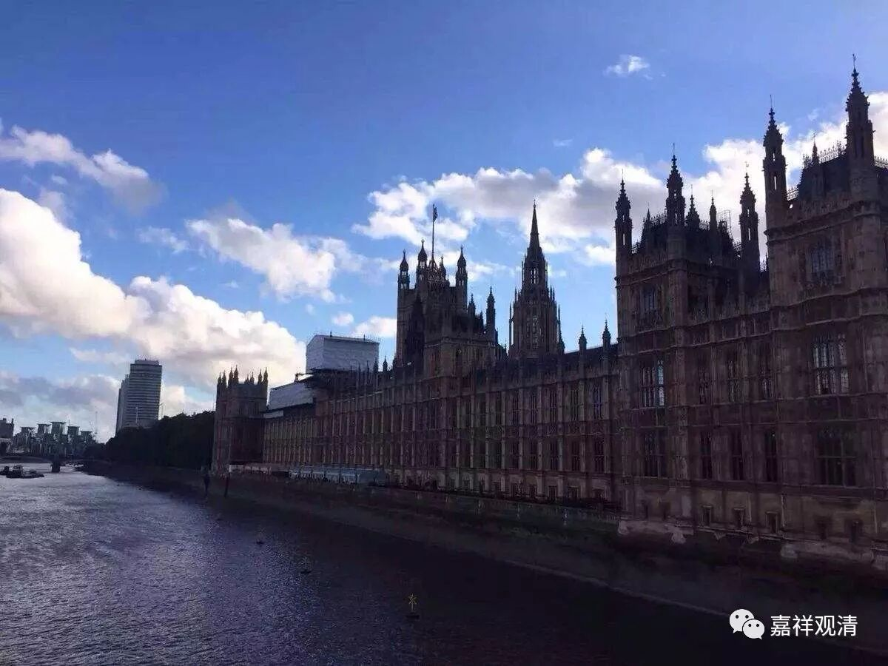

##  《菩提速道》03（下） 

**“阿底峡尊者将此道次第秘密地传授予善知识仲敦巴。”“仲敦巴尊者曾不解地问：‘尊者为何对他人传授密咒，而对我传授这个道次第呢？’**

**尊者回答说： ‘除你之外，我没有找到可以托付这个法的人呀！’**

**然后把这个法的口诀传授给了仲敦巴尊者。这是加持他称为教法之主，也是预示着善知识仲敦巴弘法利生的事业，将来极为广大的缘起。 ”**

**“阿底峡尊者将此道次第秘密地传授予善知识仲敦巴。”**从这一点来说，其实到了今天还是一样的，就是我们可能完全不了解师父的 “ 密意 ” 。你看，今天在大陆也好，在西方也好，在台湾也好，都是这样的 ——我们会看到大量的师父在传授密法。大家就会觉得“这个法很重要、很好”，于是削尖了脑袋要去参加密法的灌顶，进不去还不高兴，进去了，也灌完顶了，却又啥也不做。就这点来说，以前的人还不错，灌完顶后还去闭关呢。可是，大家在学习道次第的时候呢，就觉得好像感觉一般般，包括学习其他佛教的基础内容时，也觉得一般般。 

干脆这么说吧，以前曾经这么做的人呢，我希望他们在看道次第的时候呢，能够关注这段话，应该去看看自己能不能参透师父的密意，师父灌顶和师父讲授道次第，到底哪个更重要。师父们有时候是为了更好地利益众生，或者针对特别的化机来做事的，既然大家都喜欢这个，那就灌一些顶，但是背后的内容可能我们并不清楚。 

其实在道次第的这些书中，都已经很明显地看出来了师父们的密意到底是什么 ——就是道次第啊！ 在西藏也可以这么说，每年活佛都会在他的教区进行小型或者大型的灌顶，小型灌顶至少有一个村子或者周围的几个村子过来，大型的可能有几万、几十万的人过来。但是，活佛真正想要干什么呢？到底是不是真的就想要传这些密法呢？或者说真的把他最重要的密法就这样在草原上托付给几十万人了？ 你可以看到，实际大师们常常是借这个机会来给大家讲讲道次第，很多人法会里面听道次第这部分的时候心里得到了改变，这对他们才是真正得到的受用，而不是脑袋顶上开了一个大洞！ 

我希望大家不要这样想。如果傻呢，那没办法，反正下辈子也还可以继续修，总有一天会聪明的。但如果真的觉得自己聪明呢，那你不妨看看道次第这些书，到底师父所传授的哪些东西才是重要的。 为什么阿底侠尊者要把道次第托付给仲敦巴！而不是什么甚深密法。 

我们现在来看，这个方面好像真的很难啊！我觉得西方人算是比较聪明的了，但是 今天 西方的情况也像昨天聊的一样， 在他们学习佛教时好像也表现出一种反智主义的倾向，也和我们这里表现得一样严重！ 哪位活佛灌顶的时候，全世界的弟子全都跑去灌顶了。但是他如果讲道次第的话呢，绝不会有全世界的弟子都去听道次第的 ，坐下来稀稀拉拉的 。你看那些书呢，也翻译得很难看懂。其实可以发现，他 （翻译） 本身并不想学太多的东西，也不觉得自己错。是不是显宗的佛教就这么容易？是不是道次第 对他 就太容易了， 不学就能懂， 只要随便把英语学好就可以翻译了？我们这里有几本 某个翻译从英文 翻译 过来 的 格鲁系统的 书，实在看不下去了， 翻译本人根本不懂啥是佛教，空性方面更是缺门， 说是翻译，其实 完全是瞎鼓捣，我觉得这是对法缺乏一种发自内心的尊重 。 

《俱舍论》说， “判法正理在牟尼”，于是有些人也照着说：“我们师父说翻译得好！”问题是，你们师父看得懂中文的话，何必要他翻译？！一个崇尚智慧的学派，搞出反智主义的 山头文化，也应了《俱舍论》的 “世间法眼久已灭”了。 

呵呵，发点牢骚。 

