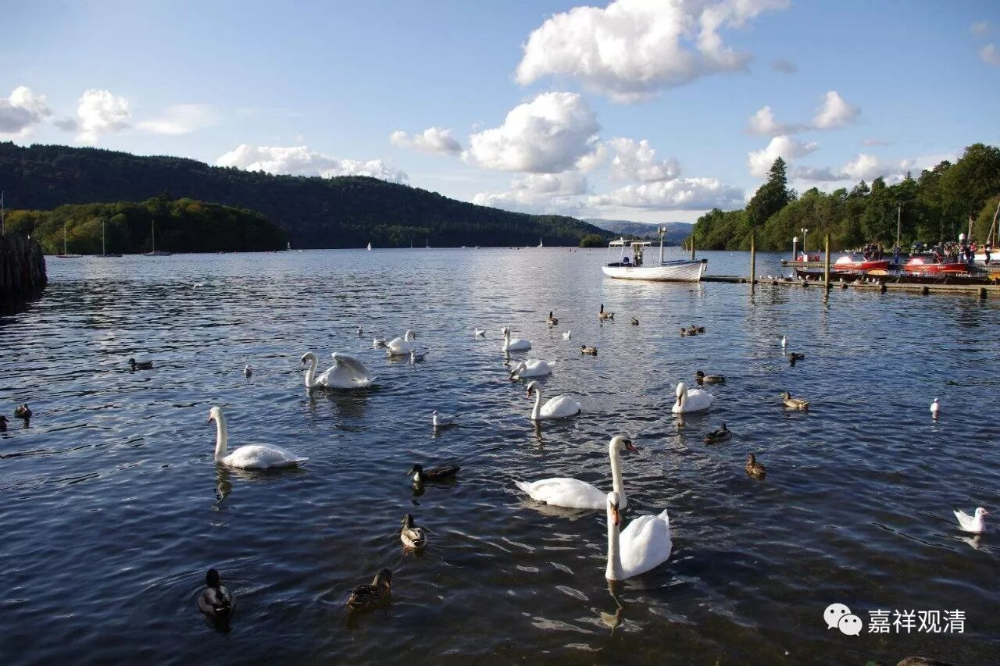

##  《菩提速道》004（下） 

我们从 留存的 道次第师承 文献 当中可以看到，早期的嘎当派的教授都很平实，离我们 的生活 很近，看起来真的有点 类似 现在的南传 佛 教， 有点像原始佛教， 很贴近大家。 

我自己私下有个想法 ——没有考证过，可能是和阿底峡尊重去过苏门答腊金洲大师那里有点关系。金洲大师那个时代 ， 苏门答腊 虽然是大乘佛教，甚至也有密教流行的背景，但那个地方也是传统的南传 教区 ，或者今天我们讲的大 寺 派流行的背景。在这样的背景下，对戒律和声闻教法的实践应该是比较多的。我们在阿底峡尊者的传记当中也看到，他们那么多比丘出来 迎接 的时候都是很如法如律的，是可以看出来受到了声闻教法的大量影响。（我也可以提醒一下大家，以后有机会是不是一起研究一下呢？最近又发现了金洲大师的文献哦。） 

南传系统中，对慈悲喜舍四无量观是比较重视的，这一点，我们在觉音大师的《清净道论》中可以看到，而四无量观的修法，和菩提心修法 有相似之处 ……

我们现在是属于私下聊哦。如果大家看一下菩提道次第当中菩提心的修法，宗喀巴大师是把增上心放在菩提心的前面（ 照如石法师的说法，早期噶当派的教授里， “ 增上意乐 ”这一支 本来是 放在 “ 菩提心 ”这一支 的后面），再往前面是慈心和悲心，在慈悲以前所有的这些修法，你们看看是不是和南传 “四无量”的修法很接近呢？在此之后进行了一些大乘的抉择，后来 经过噶当派而至宗大师的抉择， 就变成 今天的 菩提心 七因果 的教法 ——是不是这样呢 ……

