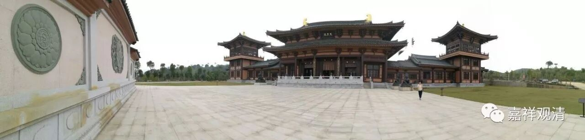

##  《菩提速道》012（下） 

那么，我们再回来看《菩提速道》。是不是一切都可以摄入三士道当中呢？有什么理由呢？ 

**“所有佛经中开示的一切道，都可摄入三士道次第中者：因为诸佛从最初发菩提心，中间积聚广大资粮，直至示现圆满成佛，无不是为了利益一切有情。因此，所说的一切法也都是为了成办有情的利益。”**就是为了大家的好处 ， 为了让大家能够得到好处 。**“要成办的有情利益，有现前的增上生和究竟的决定胜两种。”**现前的 “ 增上生 ”，也有 翻译为 “ 安乐 ”的； 究竟的 “ 决定胜 ”呢， 就是解脱 。就是说，对有情或者对众生的好处，不外乎是两种：眼前的 “增上生”和究竟的“决定胜”，即眼前的安乐和究竟的解脱。 

**“从着眼于成办现前增上生方面出发，所说的尽所有法门，都摄入共或正下士道的法类中。”**就是说 ，在 安乐这个方面 ， 下士道的内容都可以算在里面了 。下士当中有 正下士和共下士 。 也就是说 ， 为了现在和将来获得世间安乐的方面 。 

**“决定胜又分为解脱和一切智两种： ”**解脱又分为两种 ： 一种是二乘 —— 声闻罗汉 、独觉 罗汉 的 解脱 ， 广一点讲就是阿罗汉的解脱 ；一切智的解脱 就是成佛 ， 就是所有的障碍全部都断除 。 这两种 就是 决定 胜。**“为成办解脱所说的尽所有法门，摄入共或正中士道的法类中；”**单单成办二乘解脱的 ， 就属于共中士道和正中士道的范畴 。在大乘当中，这个就称为共中士道，因为它是和正中士道所共的，那么正中士道就是二乘的，他们这一类的修行方法，就称为中士道。**“为成办一切智所说的尽所有法门，则摄入上士道之中。”**广的 修行 ， 和成佛直接有关的这一类都摄入上士道当中 ， 也就是菩萨道当中 。 

三士道的类似说法，可以在《瑜伽师地论》里见到 ……

