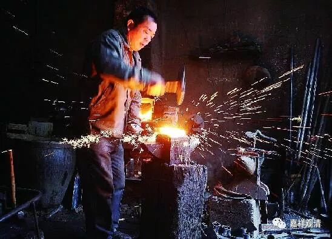
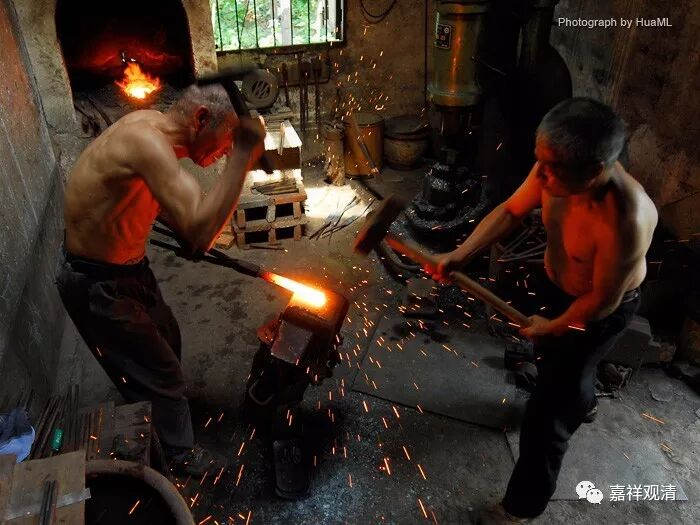

##  生般、有行般、无行般 

《现观庄严论》说到“大乘二十僧”，有“……一间中生般，行无行上流……”，这里，想就三种“生般”，即：“生般”、“有行般”、“无行般”略作讨论，敬请指教：） 

这里，“生般”，通常无甚分歧，稍稍说明的，就是，“生般”有广义和狭义。广义的“生般”，就包含“生般、有行般、无行般”三者，指生于色界而般涅盘者。狭义的“生般”，指才生色界便般涅盘者。前者，如《现观庄严论略释》：“谓生色界乃得彼解脱道者”；后者，如《杂集论》：“生般涅盘补特伽罗者，谓二结俱未断，纔生色界已，即便圣道现前，得尽苦际”。这里的广、狭义之说，不难理解。 

“有行般、无行般”，诸经论中则有两种说法，安立有较大不同。 

先说较多的一种说法： 

“有行”指“有功用行”，“无行”指“无功用行”。也就是说，“无行般”的圣人要“根利些”（这里权依二乘圣者而言）。最明晰者，属《杂集论》，次第安立上，就是先“无行”，后“有行”。 

《杂集论》卷第十三（括弧里是安慧论师对《集论》的注释）： 

无行般涅盘补特伽罗者，谓生彼已，不由加行，圣道现前，得尽苦际。（不由加行者，由宿串习力，无漏圣道，任运现前，无功用故。） 

有行般涅盘补特伽罗者，谓生彼已，由加行力，圣道现前，得尽苦际。（由加行者，与上相违故。） 

《现观》的疏解，大多采用此说。（参见附录中的引文）《俱舍·贤圣品》对此说亦有提及，而说：“如是次第，与理相应”，有可能也是世亲论师所赞同的（经部说）。 

第二说在《俱舍》里，作为“有部”的正义被提出。《俱舍·贤圣品》： 

“ 有行般者，谓往色界，生已长时加行不息，由有功用，方般涅槃，此唯有勤修无速进道故。 

无行般者，谓往色界，生已经久，加行懈息，不多功用，便般涅槃，以阙勤修速进道故。 ”

这里是说：作为“生般”者，前者精勤加行，后者“加行懈息”。前者较厚者证得为速也。次第而言，先“有行般”，后“无行般”，“有行般”者根稍利些。 

两说中，第一说，“有行、无行”是指的有功用行、无功用行（类似菩萨六、七地的差别）；第二说，“有行、无行”是指的有（精进）加行、无（精进）加行。 

支持后说的，似乎在《现观》的疏解中不多见。 

由于，《现观》的次第安立是先“有行”再“无行”的，狮子贤的《疏》中，也未调整先后次序，故，或当后说较合论义？ 

在批读经论时，看到《阿含》说，好像解了疑。 

三种“生般”，汉译的《阿含》中也提到（南传本《中阿含》中没有对到，没有与此经相应的经典）。经文稍长，但有必要全引：） 

《中阿含经卷第二·七法品善人往经第六》： 

“复次，比丘，行当如是：我者，无我，亦无我所；当来无我，亦无我所。已有便断，已断得舍，有乐不染，合会不著。行如是者，无上息迹慧之所见，然未得证。比丘行如是，往至何所？譬若如铁洞然俱炽，以椎打之，迸火飞空，堕地而灭；当知比丘亦复如是。少慢未尽，五下分结已断，得生般涅盘。是谓第四善人所往至处，世间谛如有。”

“复次，比丘，行当如是：我者，无我，亦无我所；当来无我，亦无我所。已有便断，已断得舍，有乐不染，合会不著。行如是者，无上息迹慧之所见，然未得证。比丘行如是，往至何所？譬若如铁洞燃俱炽，以椎打之，迸火飞空，堕少薪草上，若烟、若燃，燃已便灭。当知比丘亦复如是。少慢未尽，五下分结已断，得行般涅盘。是谓第五善人所往至处，世间谛如有。”

“复次，比丘，行当如是：我者，无我，亦无我所；当来无我，亦无我所。已有便断，已断得舍，有乐不染，合会不著。行如是者，无上息迹慧之所见，然未得证。比丘行如是，往至何所？譬若如铁洞燃俱炽，以椎打之，迸火飞空，堕多薪草上，若烟、若燃，燃尽已灭。当知比丘亦复如是。少慢未尽，五下分结已断，得无行般涅盘。是谓第六善人所往至处。世间谛如有。”

这里，以锻铁作喻，与三种“生般”之锻铁喻衔接紧密。“堕地而灭”、“若烟、若燃，燃已便灭”、“若烟、若燃，燃尽已灭”，分别喻“生般”、“有行般”、“无行般”，极易理解。 

《阿含》说同于上文所引之第二说，也在次第的安立上，与《现观根本颂》、狮子贤《疏》亦保持一致，所以，二说中，小僧倾向第二说，各位贤者以为何如？ 

