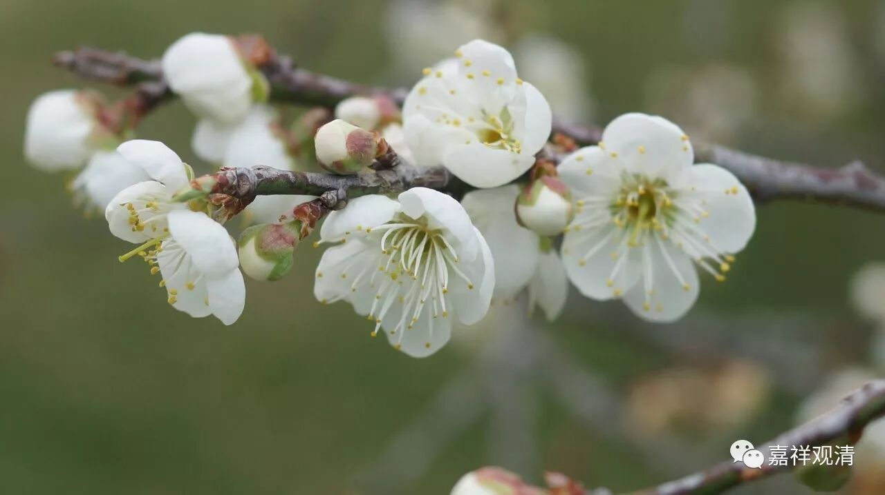

##  《菩提速道》014（中） 

再换个理路来讲讲吧！大乘的大，是 “ 大 ” 在什么地方呢？就是大在这个地方 ——用无量的理路来证明。 

**“利益很大的道理者：**

**中上士夫也一定需要获得增上生位修法的身体，以用来持续修习正法；下根的补特伽罗若未生起中下士夫的心量，虽趣入上士道，然终生不起上士意乐，又弃舍了下二者，终将一无所成。 ”**

我又来拆台脚了。老实说，我个人认为，真的是正下士夫的话，这个书他看不懂啊： “补特伽罗是什么东西？士夫又是什么意思？”他是看不懂的。真的他还是不是这个根器啊！ 他没打算花精力学习啊！ 

很久以来都一直有人问： “什么是补特伽罗？”“补特伽罗是什么意思？”简单点，你就把它理解为众生。它的原意是数取趣，“数”就是不断地，“取”就是趋向，“趣”就是六道。它的原意就是在六道当中，一会上，一会下，一会上，一会下。现在来讲，差不多就是有情的意思，西藏有一个词叫“满漏” 。士夫的意思也差不多，你就把它理解为补特伽罗也可以，如果理解为人的话就稍微有点不太对了。 

这段的意思是说，即使你是上上的根器，你也需要下面这些修行的内容。下士道是什么呢？就是明天比今天好，下辈子比这辈子好，对吧？是为了要获得人天的身体。所以在这里说，你修法的话，也是需要人天的身体，是这个意思。因为中士道和上士道也需要靠人天的身体来修行。 

