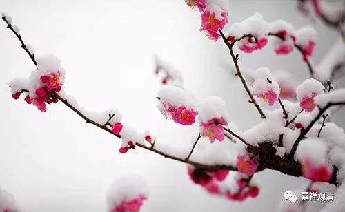

##  《菩提速道》014（下） 

那么下士夫呢？ “下根的补特伽罗若未生起中下士夫的心量，”如果他们还没有生起中下士夫的这种心呢，即使想趣入上士道，但还是生不起上士的意乐，“又弃舍了下二者，终将一无所成。”

我们经常有这样的情况，自己的水平很差，可能就像我们所讲的，自己只是藏教的 （或者说小学的） 水平，结果自己又不愿意承认，就觉得我要看圆教 ）或者说研究生） 的书，那最后肯定是失败的。如果在他面前的这个书当中，是比较圆满的，藏通别圆 都有的 ，至少对他就会有一定的利益。而对于应该看圆教的书的人，如果看藏教的书的话，那至少也没有坏处 ，至少也能加深印象 。 

**“因此，若欲趣入总的大乘道次第，尤其无上瑜伽者，必须将共中下士道作为殷重修习的要点，此至关重要。”**对于总的大乘修行的道路来说，前面的也是必须要修行的 ——这个说法在我们今天看来好像并不难理解。意思也就是说，你要读大学，肯定要从小学、中学过，哪怕是跳级、少年班等等，也要从基础过。 

**“如文殊菩萨说，因此，暂且放下所谓的甚深密咒教授，最初应对出离心、菩提心尽己所能生起觉受，此若生起，则一切善法自然地转成解脱及一切智之因。那些认为此不值得修习的人，实在是全不了知圣道的关键所在。”**

就像文殊菩萨所讲的那样，道次第里面也这样讲： “暂且放下所谓的甚深密咒教授。”我们 现在 不要把密宗的东西看得有多了不起，有多重要。最近我还碰到一个人，是其他人在网上拉进来的，后来我干脆这个人给踢了。为什么呢？别人告诉我这是在天津密宗圈子里面很有名的一个人，已经学习十几年了。可我发现这个人就是连下士道、中士道都没有，一直在微博上发吃海鲜的消息，还很高兴的样子。我问他： “什么是戒律？”他回答的意思居然是：“那你们吃素算不算杀生呢？”

号称学佛十几年了，还 自称 学了道次第、密宗等等，就学了这些东西吗？ 完全是一般人的知识结构，在世间知识和佛教相违的时候， 他选择的是世间知识， 嘴还非常硬，这真的是很可惜啊！这样的人，无上密对他来说就是大毒药。你如果知道惭愧： “我错了，杀生是不对的。”或者说：“我守得没有那么严。”那就是另外一回事情了。但是，你这么做了，还觉得自己很对，那完全是 无惭无愧 。 

无上密的灌顶之前就有这么说： “喝下这个水之后，如果你犯了戒的话，这就变成让你下地狱的毒药；如果你不犯戒律，好好修行的话，这就是你修行的甘露。”他根本什么不知道，只管进来灌顶，只管在那里喝水，根本不懂里面的内容，很可惜啊！ 

世间人学佛，习惯性的思路是： “哇！这么多好处啊！我要！我要！！我要要要！！！”看到要注意的地方，看到戒律、承诺，却并不当回事，拿出一句：“这些嘛，不要执着！”……其实我们一般人做其他事也都是这样，只要好处，不论禁忌……

