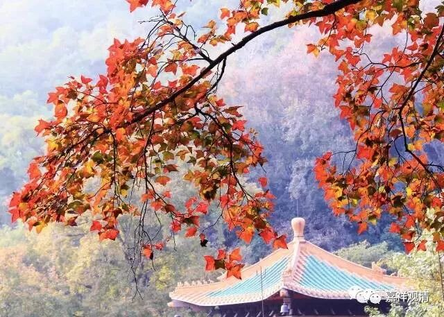

##  《菩提速道》讲记017（上） 

**“戊六、至心祈祷，一定让心续与教授相融合。”**这是什么意思呢？比如说念菩提道次第的求加持的颂， 或者是念历代祖师的名号，一边念的时候就要一边想 、要生起真切的虔诚、祈愿心 。当然，我们其实有一个先天的缺陷，因为藏传的法师的名字对我们来说仅仅是一个概念性的名词，不是鲜活的。 

你在念到这个名字的时候，我们确实是在向他祈祷，但是念归念了，祈祷归祈祷，心里面却是没有概念的： “他是谁啊？他好在什么地方？给我们什么加持啊？”其实不是很知道的。这些对我们来说，先天就有点弱势。假如说把这些藏传法师的名字换成太虚法师，在他的面前求加持，那太虚法师这个词对我们来说就是很鲜活的，在法尊法师面前求加持也一样，对我们都是鲜活的。 

但是如果念到 “洛桑扎巴跟前求加持”，我们还需要反应一下：“噢，这就是宗喀巴大师。”念到“南喀坚赞跟前求加持”，也是要反应一下：“噢，这是宗喀巴大师的师父。” 但对我们来说，这些名字后面似乎就很空洞。 

所以，有时候你不学的话，真的是有点累的。但是学的话呢，又会 有太多的知识内容。 像我们前两天所讲的，假如我现在要达到陈那 大 师的水平的话，那我的实际水平要比他高得多，因为我需要掌握比他更多的知识才行，就是他所有的知识我都得掌握。这就像当年更敦群培说过的一句牛话，当时大家问他怎么不去听他的师父喜饶嘉措的讲课，他就说了一句话： “他知道的我都知道，我干嘛要去听呢？”这句话的意思就是：他所讲的全都是我的所知 的范围，那 我肯定比他厉害！那么，假如陈那菩萨那个时代的知识我全都知道的话，我肯定比他厉害多了。假如现在格西们的知识我也真的全都知道的话，那我比他们就不是厉害一点半点啊！ 这个知识范围就太宽了 ……好希望 哪一天能够像《 黑客帝国》 里的尼欧那样，脑子后面有个接口， 接入电脑，插一个芯片，一下子，就都掌握了。哇， 爽！ 

所以在念这些颂文的时候，心里面很难生起那种鲜活的感觉，我自己也觉得心里面很难生起大的感动。 《 道次第师承传 》 我们也看过，是吧？但是对我们来说，总好像是纸面上的东西。现在还好一点，在我以前的感觉当中，西藏的这些僧人都像是动画片里面的一些人物，就是没有感觉他们是真正的和尚。到现在才慢慢地有点感觉了 ——他们是真正的和尚，这个感觉是慢慢才有的，因为我们对 “ 和尚 ”、“出家人” 的感觉一直就是汉地和尚的样子。 

在我们的想象当中，他们都是穿着这种僧服，戴着这种高帽子，在那里端坐着的，总好像和我们心中从小得来的 “ 和尚 ” 的感觉是有点差距的。当然，这个差距现在慢慢地越来越缩小了，因为我们唐卡看多了。 （ 我们总是习惯地认为西藏的喇嘛是常年戴着帽子的，实际上他们平时是不戴帽子的，只有在正式的场合才会戴那种帽子。 ） 

我在最初学道次第的时候，脑子里的 “ 南喀坚赞 ” 啊、 “ 仲敦巴 ” 啊等等，都感觉不像真的人，心里面要生起感觉是很难的。对印度人我还可以生起一点感觉，那是从小学的。没办法，那就只能多看道次第的 《 师承传 》 ，对他们的历史故事尽可能多了解一点，相对来说，在他们面前生起的祈祷心就会比较真实一点。否则就真的仅仅是概念了，你连这些人是谁都不知道，更不用说 在他面前内心生起虔诚的 祈祷了，是吧？ 

有时我也觉得自己挺幸运的，因为我现在只要念这几十个人的名号求加持，到了七八百年以后，后面的弟子们 可能 就要念一百多个人的名号求加持了。从这个角度来看，西藏一手把从龙树菩萨到月称论师中间的中观派祖师全部切掉了，真实挺谢谢他们的 （哈哈） 。六百年当中，得有多少祖师啊！就这样被他们一刀切掉了 ——我们只要念两个人的名号就行了 ，龙树 ——月称 。 

