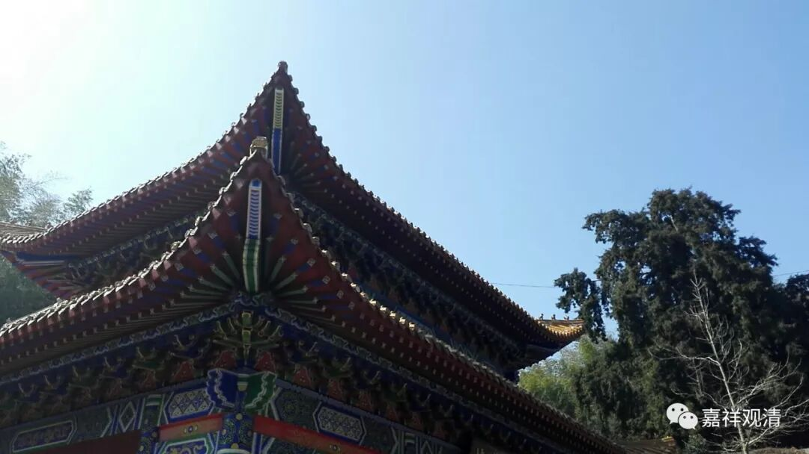

##  《菩提速道》019（下） 

这个是印度的规矩， 涉及到这个， 你就得按照这个来。因为我们中国也没出现过另外一位像龙树大师这样的人物，那印度的规矩就是这样，就得按照这个 流程走一遍 。就像我们在前面也讲过的，一定需要吉祥草吗？其实你用其他草代替也行。 

八供就一定是要这样吗？实在不行的话，我看放八块石头也不是不可以。但实际上水是很容易得的嘛，杯子也是很容易得嘛， 所以也有用水代替的， 那就 有 这样 的习惯 。实在不行的话，用一个杯子来代替也行啊！如果是中国的习俗的话，可能确实不是这样的，估计就是一些月饼啊 、绿豆糕啦 什么的。 假如有 中国八供会是什么样的呢？ 我看 茶肯定要有吧，普洱茶 、绿茶 是吗？香还是要点一下的吧，音乐可能还是要有的。噢，还有水潽蛋 ——就是糖水鸡蛋。那以后我们这个流派就是供水潽蛋（开玩笑哦，不是真的）。 

那么，陈设供品的原因是什么呢？都是有背景的。意思就是先把佛菩萨请来，那你就要有相应的供养 ——待客之道 ，然后再想我把佛菩萨请来要干嘛，是吧？**“也不应为了期求今生的名闻利养，而应为了利益一切慈母有情，无论如何，必须速疾速疾获得圆满正等觉的佛陀果位，为此而供养三宝。”**

这个 “供养三宝”呢，也是我们心里面这么想。就像前面的观修一样，我们观想一切众生所有的障碍都消除了，但实际上是不是都消除了呢？其实不是的。那么，我们观想得到诸佛菩萨这样的加持，是不是现在就得到了呢？其实还是需要我们自己修行的，不要以为光是这样就可以了哦。 单纯靠外力加持，呵呵，是不是佛教都不好说 ——单纯靠外力的教义，印度传统里多的是。 

**“若能这样思惟布设供品，献供者才能得益，这样的献供才有意义，因此应如是献供。”**也就是说，你这样做才有实际的意义。 

