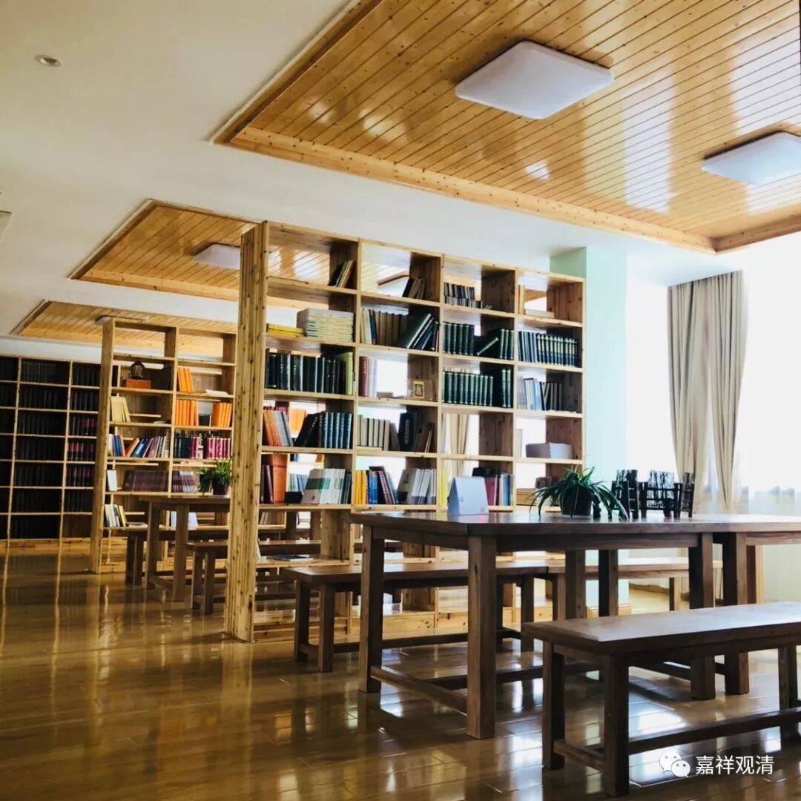

##  《菩提速道》020（中） 

夏坝活佛专门打造的那个火供 炉子 就很好，真是很漂亮，桌子大概也就这么大。其实夏坝仁波切的这种火供 炉子 ，如果在 做工 上再加上日本的精致，就更漂亮了。他现在用的那些木头啊等等 ，还是西藏的套路， 还是比较粗犷的，而在日本，木头都削成这个样子 （二十厘米长，大概两厘米宽，一厘米厚 的木条 ） ，上面再写上名字， 诸种吉祥的祝福 ……这么做 真是很好的 ，高大上 。我们以后 可以 试试看 。 我先去买一个 日式的火供炉（桌） 。月底先去佛展会看看。 

其实没必要去日本买，日本人其实也是在中国进货的，在义乌定制的。现在中国的很多佛具厂都可以做到那么精致，而且利润也已经很薄了，大家都在做。因为中国是不缺工匠的，那么多美院的、雕刻专业的，毕业以后找不到工作或者自己又没有工作室的，都到佛具厂去了。所以这方面的精细度他们都是可以做到的，都不难做到。 

有人说不缺工匠，缺工匠精神。实际上 让我说， 是缺银子。我要一个东西，出 10万元，你给我做好就行了，那绝对会出现 “ 工匠精神 ” ！工匠精神是什么东西？工匠精神就是大量资源的聚集。你看，以前的青铜器做得这么好，而现在做不到，是什么原因呢？因为现在没有人这么去做青铜器。为什么做不到呢？完全做得到！因为当时全国最好的工匠都集中在王宫，所以两千年前、三千年前的青铜器可以这么精美，就是因为最好的工匠都集中在这里。 

如果你今天砸下一千万 、一个亿 ，就是要搞个青铜器工厂，就要做最好的青铜器，做不出来吗？肯定做得出来！我去过一些私人的博物馆，他们介绍说： “不要说某某时代的器皿不行。什么不行啊？明明人家民间珍藏就有最好的。”为什么呢？就是那些官家当中的精器。你只要把银子堆在那里，绝对有人做得出来，比如掐丝的 金器 那些等等。今天做不出来吗？照样做得出来。 

这其实是一个很简单的商业背景，你就是要让大家知道 资金在某个地方聚集 。比如说今天在丝绸之路可以挖出很多好东西，因为当年的敦煌就相当于 我们今天的 上海 , 在大商道上， 大量的工匠、大量的资金全部流向这个地方 ，所以会有很辉煌的文化沉淀 。那一千年以后你也可以在上海挖出很多好东西 ——“诶，挖出一个，观清大师用过的茶杯”、“又挖出一个，这是当年的科技民用的顶峰，人们离了他都活不了，知道是什么吗？是路由器！”……钱在什么地方聚集， 政治、经济、文化就会勤倾斜过去 —— 因为钱都在这里嘛。 

