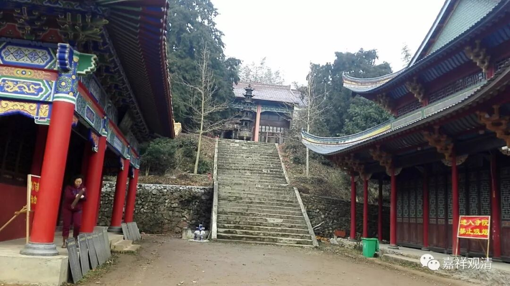
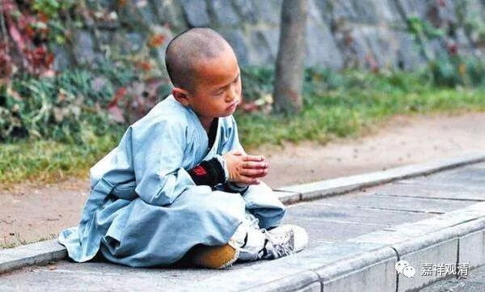

##  《菩提速道》讲记021（上） 

**“（三）腰应当伸直，脖颈略向内勾。”**“ 向内勾 ” 其实就是向下 类似微微点头那样 的 意思 。“ 腰应当伸直 ”，其实 真正坐的时候腰有时也是塌的 。 你去看西藏的或者是南传的打坐的姿势 ， 很多照片上都是 躬 着背的 。 当然不是说要弯得这样厉害 ，而 是坐着坐着就会慢慢 软下来。其实坐一会儿之后，你就观察一下自己，再调整一个舒适的姿势。长时间这样也不舒服的嘛，再调整一下姿势就行了，有时太直了也很累的嘛。 

其实这也有点像中道一样，太极拳里面经常讲“松而不垮”，是吧？你不能垮掉了，那不像话。而你太直了，其实也挺累的嘛。一直这样坐的话，结束之后你的腰背 很酸的，那时真想马上 找人推拿一下。你们看到日本和尚在电影里面都是背很直的，那是因为有摄像机。如果有摄像机对着我的时候，我也是坐得很直 ……

**“（四）齿唇自然放松，舌尖微抵上腭。 ”**牙齿不要咬 合 上 ，而是 刚刚张开一点点的样子 ，舌尖要抵 上牙龈 。 

**“（五）头勿偏斜，正直而住。”**头不要歪 。 有时候会有点累的 ， 我看 到 很多人打坐时间长了以后 ， 头就抬起来 了。 在打坐 稍微 过一段时间的时候 ， 你 不仅 要调整你的心 ，也 要调整身体的 。 自己感觉 头慢慢抬起来了，就稍微 低下来一点 ，不要 再扬起来 。 

**“（六）眼视鼻尖。”**“ 眼视鼻尖 ”是 大概地去想 ， 不是真的用眼睛去看 ， 否则 就 变成斗鸡眼了 。“ 眼视鼻尖 ” 就 有点 “ 用 心 去 看 ” 的 意思 ， 眼视 的 方向 是鼻尖的这个方向， 真正所谓的 “ 视 ” 是意识往这个方向去关注的样子 。 

**“（七）双肩平舒。”**肩平 ， 一高一低也不行 ， 要平 。 太极拳、站桩都要求 沉肩坠肘，就是这个感觉，肩，要向地找，不要抬肩。 

**“（八）气息均匀舒缓，如此合为八支。”**前面七个为七支 ， 加上这个 “ 气息 ” 为 “ 八支 ”。 就是数息。 “ 均匀 ”， 指这时的呼吸 不是一头 细 一头粗 。比如你 刚刚跑完步就打坐的话 ，气息 就是很粗的这种 。现在你要放细，要“舒缓” 、要均匀 。这样就是“八支”了。 

