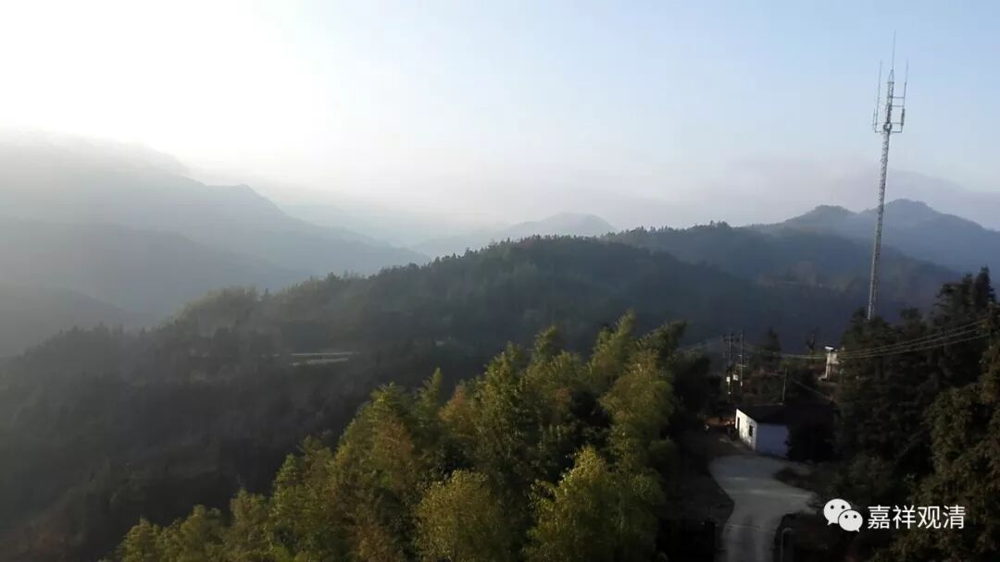

##  《菩提速道》021（中） 

**“气息均匀，指呼吸不可用力急促有声等。 ”**声音不要太响 。**“若气息不匀，可以慢慢地数出入息， ”**慢慢 地 调整呼吸 ， 可以用数 息 的方法 。**“数到二十一然后修定，则堪为修定之器。”**这 个 二十一 ，我没有找到经论的依据， 为什么是二十一呢 ？我不知道，说不定是哪个版本抄错了也有可能，但是现在都是这么说，说二十一。反正祖师们都说是二十一，那我们也就说二十一。如果按照其他的方法呢，一般来说，都是数到十就可以了。不过，数到十、数到二十、数到五十、数到一百，都可以。 

这个方向其实是从密宗发展出来的，你可以这么坐，没问题的。在密宗当中他们的姿势还不一样的，有些师父是这样，然后这样，也有的师父是这样 …… 姿势不完全一样。不过我觉得这个姿势比较好看一点，有点帅，而这样就有点难看了。不过自己闭关的时候，你也不在乎帅不帅了。反正对我来说，有时候已经不需要了，因为鼻子是不通的，你就是这样，也还是不通。 

西藏经常会说“显密”，是他们习惯了，因为大部分的高僧都学过密宗的，就会把显宗的部分再加上密宗的内容。这里其实 《道次第》里面， 有些是密宗方面的内容，加上去完全没有问题，不加也完全没有问题，不过这里并没有提到。还有一些观想的内容，其实都是密宗里面 出来 的，也放到显宗里面来用了。 

“数到二十一然后修定，则 堪为修定之器 ”，是 什么意思 呢？我们 今天不是 “ 修定之器 ”啊！很伤心啊！ 我觉得他们还是 阿毗达磨 学多了 ，为什么呢？他们就没有那种模糊的概念，其实从初住到二住、二住到三住，都是很模糊的概念，它们之间是有一段模糊期的，有一段交叉期的。 

我觉得这些活佛们转世到今天的话，很多可能都是IT男，都是只有“ 0 ”和“1”：“这个数字就是这样了。”我以前碰到过一个IT男就是这样：“佛说的法只有这一种，如果和它不对的，就是错的。”“我们计算机就是这样的，不是‘0’就是‘1’。要么就是这个对的，要么就是那个对的，只有A和B。”有时候这些IT男也挺烦的，是吧？那次我把他带到佛学院去，结果跟人家吵架，佛学院的人都被烦死了。我估计现在别人看我也是这样的，觉得我烦 。那个 IT难 因为“大师”这个称呼和人家吵架。“ 你们 怎么能随便称 别人‘ 大师 ’ 呢？只有佛才可以称 ‘ 大师 ’ ！只有佛才可以称法师！”可是，一个名词不可以变化的吗？名词的含义不可以有伸缩的吗？ 没有引申义的吗？时代在发展，语言也在演变啊……

