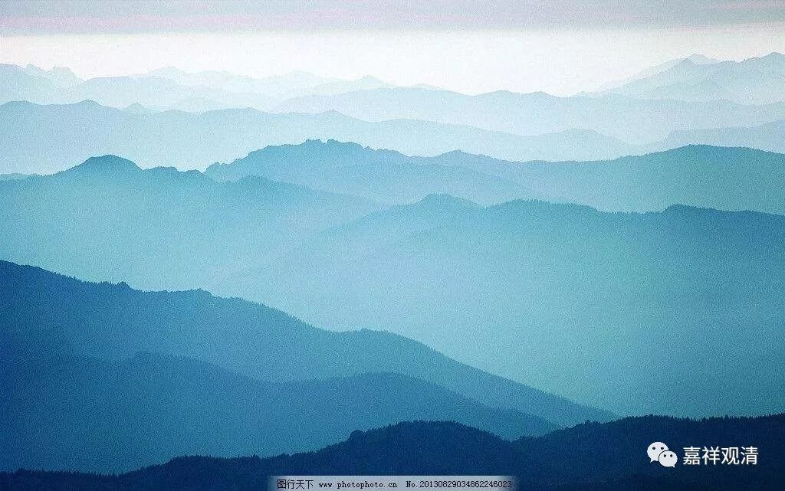

##  《菩提速道》讲记023（上） 

我们在前段时间也聊到了，活佛的转世系统好像就有这个好处，就是从你出生开始，或者从你被认证为某个活佛的转世开始，这种责任就几乎天然地降临到你的身上，你几乎被周围所有的人都催眠了： “你必须要承担这个责任，这个事情落在你身上了。”

但是，现在有一些小一辈的活佛并不觉得自己应该承担，还觉得自己做得太多了。 “你们要求我的太多了。”“我太累了！我做不到。”甚至还理直气壮地说：“是你们不对，所以把我逼得还俗了。”

我真不知道他们小时候是怎么学的，还有这种歪理。他们小时候十几年、甚至二十几年的学习，都是整个社会资源向他们大量倾斜的结果。可是现在，他们不愿意接受所谓 “不自由”的结果，就对大家发出声音说：“我太累了。”那当初整个社会所倾斜的大量的资源，你还回来呀！我 这么 说是有点刻薄了，但事实真的是这样啊！给他们配备了那么多好的老师，给他们这样崇高的地位，就是为了要让他们做这件事情嘛！你现在才说 “我不玩了”，那是一种不负责任。 

这种责任心，在这里是说 “责无旁贷”，而那些还俗的小活佛根本不觉得是责无旁贷。“凭什么啊？我也是个人。我想要轻松一点，你们不要给我这么大的压力！”最近几个还俗的活佛都是这么几句话。有时候觉得很烦啊！ 

本来就是，要求你承担这样的责任，才会赋予你这样的地位 ，权利和责任是对等的 。然后呢，社会资源 ——而且是大量的社会资源，都向你倾斜，给你配备最好的活佛府、活佛宫，教育资源也向你倾斜 …… 现在你却说： “这些东西我都不听，我都不管！ 我不喜欢！ 你们不应该这样逼我 ！ ”所以这种责任感也不是天生的，赋予了他们之后，他们又不愿意接受。 

佛陀早就授记过了，现在是一个减劫 ——情况是越来越差的。不过理论上来说，如果真的是一个修行人呢，瑜伽现量应该增上的才是，这种一点点往后退的 …… 当然我们也不知道人家真正的心是什么。 

反正对整个的教法来说，就像《掌中解脱》里面 帕绷喀 仁波切讲的一样，类似于这种事情，对一整个教区来说是个大的教难。现在的 “ 教区 ” 已经被互联网扩大了，那么这个教难其实也是被扩大了。而这些还俗的活佛们还不觉知，还觉得自己应该要有追求生活的自由。 

我对此是不太接受的，还俗就还俗了，就应该老老实实地忏悔： “我错了。在现在这个情况下，我还会继续学习。”我觉得这样的声明才是比较好的。可现在却是另一种声明：“你们让我太累了，这是你们的问题。”我都不知道他们是怎么学的。而且，还俗以后，他们的资源又没少，可以继续享受，但是责任却不用背了。我们看着 这样的 “榜样” ，哈喇子都下来了，眼睛都红了。 “你走的时候，把活佛的名号送给我也行啊！”

