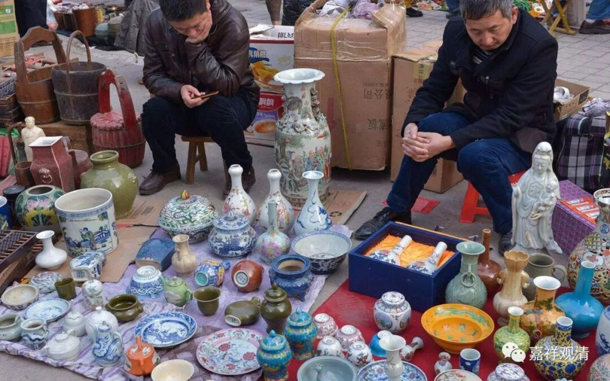

##  《菩提速道》讲记025（上） 

现在 这种情况很多 的呢。我有个兄弟去西藏买了两幅唐卡回来，挂在 佛堂 觉得很好，好像花费了几千还是几万。我那天跑去 ，远远 一看， 就知道 是印刷的。而且是先印刷，再在上面涂了点颜色。这就很恶劣啊！印刷之后再涂颜色，让你看好像是手工绘画的一样。 

还有更厉害的呢，尼泊尔因为印刷工艺很好，整幅就是印刷的， 大大小小都有， 但是你看着就像画的一样，然后他们就按照画的价格卖给你。 几万块的唐卡，实际上只值几百块钱。 

而且现在还有很多汉人也在画唐卡、做佛像等等。前两天我到宁波 某闹市会所 去，看到 供的佛像，是 他们把西藏的东西拿过来， 依样画葫芦 做 的 。我去看了一下，就呵呵了，又得罪人了： “你这呢，是做得挺漂亮的，但是肯定没有师父教过。”边上 有个行业内的人（ 他出来以后说：观清师，你可以说，我们都不敢说 …… ） 和那个老板估计都听懂了，因为实际情况就是这样的。他们把西藏的画 也 拿过来，就照样做，可是没有师父教过一些细节应该怎么样，一看就知道是不懂的人做的。 

这个就和我们平时看经论的时候一样，如果你没有学过菩提道次第，或者没有学过《百法》、阿毗达磨等等，你根本看不出来这一段里面是什么意思。比如说文字中出现 “贪”或者“欲”的时候，你可能根本没有反应过来那有什么不一样，但实际上这两个字的意思是不一样的，不同的心所。所以有些那谁讲经一开口，我们就不想听了。 有些人还嘴硬： “就你懂？！”呵呵，对了，比你懂！“ 你都没仔细看（听）！ ”呵呵， 不需要仔细看。他慈悲心证量非我所知，但经论水平的上限，我们还是可以看清楚的。 

有一次，有个香港朋友有一堆收藏，让我弟弟帮忙找人鉴定一下（我弟弟是拍卖公司的）。弟弟带着那些瓶瓶罐罐还走没进门，他那些负责鉴定的老师就说： “STOP！不要拿进来！！就放在外面！！！”我弟弟还说：“包装都还没打开了……”专家说：“别进门，抱走，辣眼睛……”

