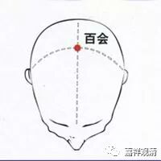
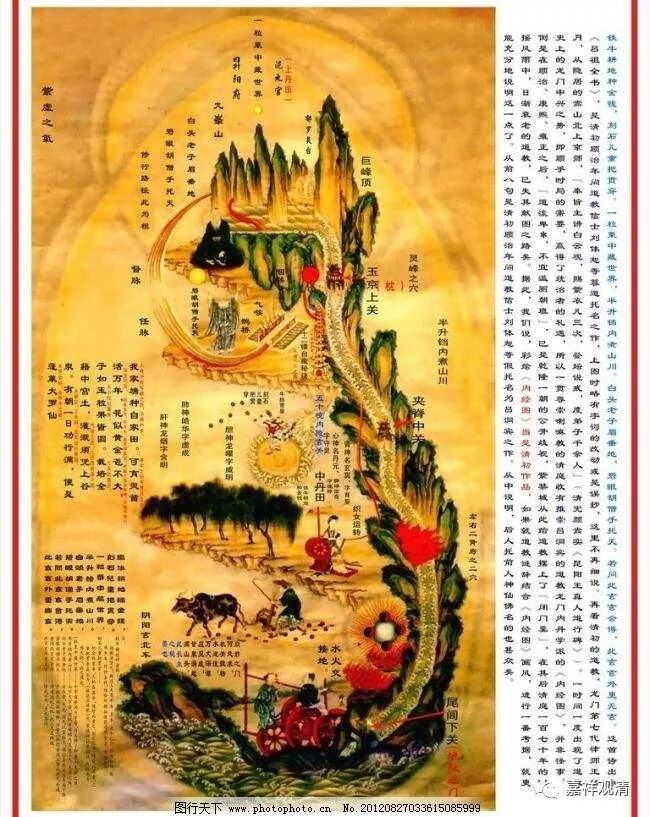
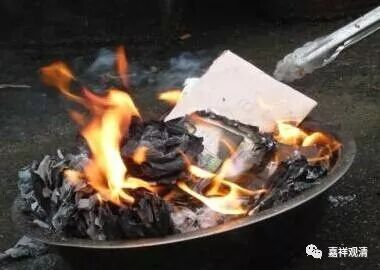

##  《菩提速道》讲记031 

夏坝仁波切说这个部位叫 “梵穴”，是吧？以前看气功书的时候，看到过“梵穴”这个词。当时就想：“‘梵穴’在哪？”于是又查字典，又找针灸的图谱，可是没找到，永远都找不到“梵穴”在哪，估计就是百会啦。这个梵，应该念fàn——梵fàn穴。按照我们今天来讲，就是百会，是吧？开口在哪里，可能并不重要。 （也有说在其他地方 ……） 

我个人以为，可能这些东西本身，就是和观想有关。比如说，道教里面讲的 “小周天”，按照中医们的论断， 头上 肯定是从这里 百会 开始 往前 ， 经 眉间下来， 然后到牙龈 、上颚 这里， 舌头一搭， 再接着下去 承浆到喉咙 的嘛。但是道家在长期的修炼丹道的过程当中，发现从 前面 这里过来会有危险，于是后来就有一派不从这里走，他们修的时候从 百会 两边下来，不再走前面， 九十度方向，走耳朵方向下来，到喉咙 …… 结果人家 “小周天”也修成了。哎？我这是把秘密告诉大家了？我们的寂如师的房间里就挂着这个 《 内经图 》 。 

**“注入自他一切有情身心之中，无始以来所集的一切罪障，尤其诽谤舍弃正法、 ”**这里的 “诽谤”就是舍弃的意思。**“售货典当、”**就是把经书卖掉，或者质押。**“置赤地秽处。”**“赤地”，就是白白的、没有什么遮拦的地上。“秽处”就是脏的地方。这个我已经不忍心讲了，其实这种事情，今天西藏还有人在做，而且还是 剃了头的 在做。仅仅因为你是我的政敌，就把你写的佛教书全部扔到垃圾堆、厕所里面。唉！ 佛陀的教育，学习者多，实践起来，大家还是烦恼那套 ……也不说别人，我也是！ 

**“其中诽谤舍弃正法的情形者，如以信解共通乘为由，而谤舍大乘； ”**这个 “共通乘”在这里只能是小乘的意思 ，这里说的是小乘舍弃大乘，今天国内还可以看到 。**“或以信解波罗蜜多乘为由，谤舍密咒乘等；密乘之中，或信解下下部，而谤舍上上部等；亦或胜解上上部而谤舍下下部等； ”**这两类情况都有。**“还有诽谤说法师 ‘有无辩才’等，由谤舍说法者，”**诽谤 、 舍弃这个说法者。**“而成为谤舍其心续上的一切正法。总之，依法所生的罪过非常微细， ”**非常微细，就是很多情况都可能造成罪过。 可是类似的事情，我们一直在做 ……

