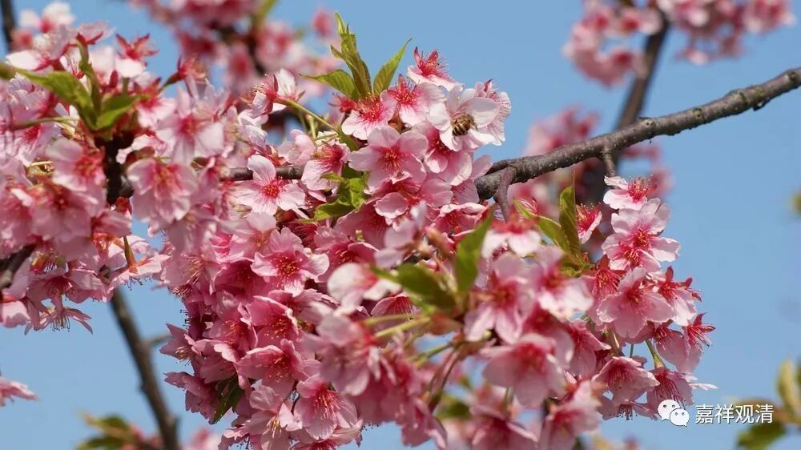

##  《菩提速道》讲记034 

从这个角度来说 ， 也就是前面所讲的，其实你都可以理解为一切 佛菩萨的总集 ——都是他，也只是他，有时候表现的是上师的样子，有时候表现的是其他各种样子。 

你如果很厉害的话，比如说你达到了克珠杰大师的那个水平，可能你在路上买一个桔子的时候，会突然觉得： “咦？卖桔者是上师的化现。”一开始我看 宗大师 传记的时候也不懂 这段 ，里面说克珠杰大师在晚上猛烈地祈祷，然后就梦到一个骑着狮子的样子： “哦，宗喀巴大师来了。”我觉得奇怪：你怎么会知道是宗喀巴大师呢？这明明是骑着狮子的某位菩萨，甚至可能连文殊菩萨都不是哦，是叫什么“五秘密显现”（我记不清了，反正差不多这个意思）。后来我才明白，对克珠杰大师来说，所有这些特殊的显现，他心里面的第一反应都是翻译为：“师父来了，师父给我 启示 了。 ”

这就像禅宗里面的一个故事，一位禅师在走路的时候，看到边上有一个卖肉的商贩。一个买肉的人过来说： “给我来块精的肉，来块瘦的。”那个卖肉的屠夫就回答说：“哪块不是瘦的？ ！ ”结果 路过的 那位禅师马上就开悟了。 

这个事情如果发生在克珠杰大师身上，他的第一反应就是： “啊？这个屠夫又是我师父！”在他的眼里看起来， 大概 就是宗喀巴大师戴着帽子，手里拿着把刀： “哪块不是精的？ ！ ” …… 实际上只要是能给他帮助的，在他眼里都是师父 的化现 。他的第一反应就是： “啊！这句话说得太好了！ 我明白了啥啥啥道理！ 我师父又化成屠夫 来指点我 了。 感恩！礼拜！ ”

所以对克珠杰大师这样的人来说，什么都是 “ 上师供 ” ，什么都是 “ 上师瑜伽 ”、上师相应法 。如果单独来说呢，这个是 黄 文殊菩萨的仪轨， 那个 是 黑 文殊菩萨的修法、 这个是四臂 观音菩萨的修法等等。但是对于会修的人来说，这些全部都 可以理解为上师相应法 。 

