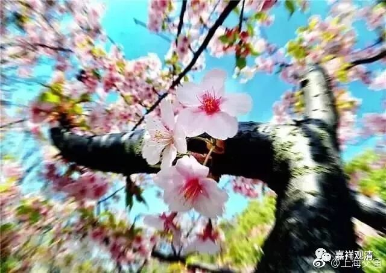
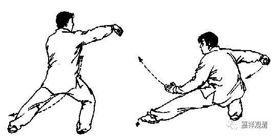
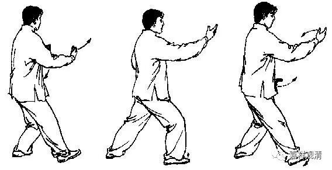
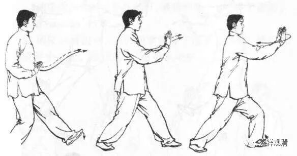
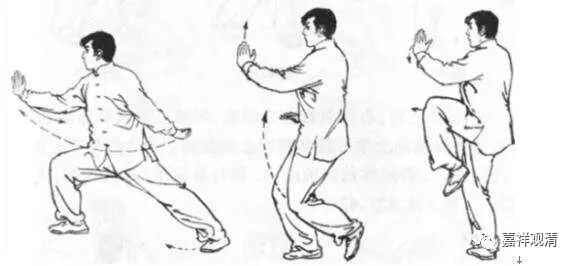

##  《菩提速道》034（下） 

有一次我在机场，航班晚点二个小时，就找了个没人的角落念经。结果跑过来一个人，在那里开始拉筋了 ——很有趣哦，可能现在大家对锻炼都很有激情。然后又来一个老头，也在那里拉筋了，后来两个人都在那里打起了太极拳。那个老头打的太极拳，我还能看得出来有点像陈氏。另外一个人的拳就看不懂了，杨氏也不像，陈氏也不像，难道 是郝 式吗？难道是赵堡太极吗？ 

等他们打完拳以后，我就和他们 聊 聊天。他们俩都算是跟着师父练拳的，但我看出来的情况就是，实际上两个人都没有得到窍诀，或者 说没有得到 一些真正的指导。不见得他们的师父就没有教，而是他们 一开始就 都是以学生的方式在学习， 而 不是以弟子或者徒弟的方式在学习。报个班，每个礼拜几节课，那你跟师父就不是天天在一起，你就不能跟他切磋、琢磨。这种小地方，比如说这个手推出去的姿势就是不对，我一点没看出来他是在打陈氏太极拳，他的感觉是完全不对的，这些细节方面可能要全部重新磨过一遍才行。 

我后来还遇到过一个，她曾经还拿过太极拳某比赛第四名，说要跟我学太极拳。我一开始都没好意思教，后来一看她打拳，呃，那真的是哪儿哪儿都是问题。她就是一个月五块钱在公园操场上学的拳，这都是没有遇到好的师父，也不会学拳。后来要纠正她的动作真是无比麻烦（后来我让她平时练拳别穿太极服、练功服，那松松垮垮的，把细节的部分都掩盖住了）。 

我就想起我们以前学太极拳的时候，从某种角度上来说，我 算是 是我们那个班里学得比较好的一个 （ 当然还不是最好的那个，毕竟我不是他真正 入室 的弟子 ） 。很明显的一点就是，我比其他那些 同学打得 要好得多，因为我和 程 老师 （五届的太极拳冠军） 在一起的时间很长，至少每天就要 一起站桩 半个小时，一些小地方 、细节 他就愿意过来教你。 哪怕是太极推手，或者易筋经的一些小地方，他都会提醒你，看到你练得好，他就会来指点一下 ，和你推个手、聊聊武林掌故什么的 …… 这 样 一点点的积累， 自己 当时可能根本没感觉，但是后来在 看 别人打拳，或者在 教 别人打拳的时候，就非常明显，一眼就能看出什么地方不对。我觉得这就是学生和弟子的区别。 

那么老师和师父的区别也是如此。如果有一个师父在身边，你一直跟着他切磋、琢磨的话，进步肯定很快。当然，你本身得确实 得 是有根器的，要不然师父也不愿意说。比如说基础实在太差了，或者协调性太差了 ，那师父也不愿意教 ……学佛也是一样。 我发现现在有些人是以学生的心态、方式来学佛的，到点来上课，下课收拾收拾回家，和老师很少交流 ……其实和老师平时的互动很重要，至少也会多些互相了解、互相“键入”的时间。 

拿道次第来讲，一开始是你挑师父嘛，当然要是顶尖的 ，谁都想要找好师父 。但是肯定师父也要挑徒弟的，你水平不够的话，师父怎么教你也教不出来的。点化不透，怎么办呢？那就把一批大众一起带出来算了，而他真正愿意带的顶尖弟子肯定是不多的。你看形意拳好了，总教头李存义大师建立的国术馆，带出了很多人。其实大师看有些人也是不满意的，那就随便教完就算了。但是最后有两个人冒尖了，就是很死命地练，练到最后 功夫上身了，他再刻意多指点一下 ……这 类似于他的嫡传大弟子了。 

