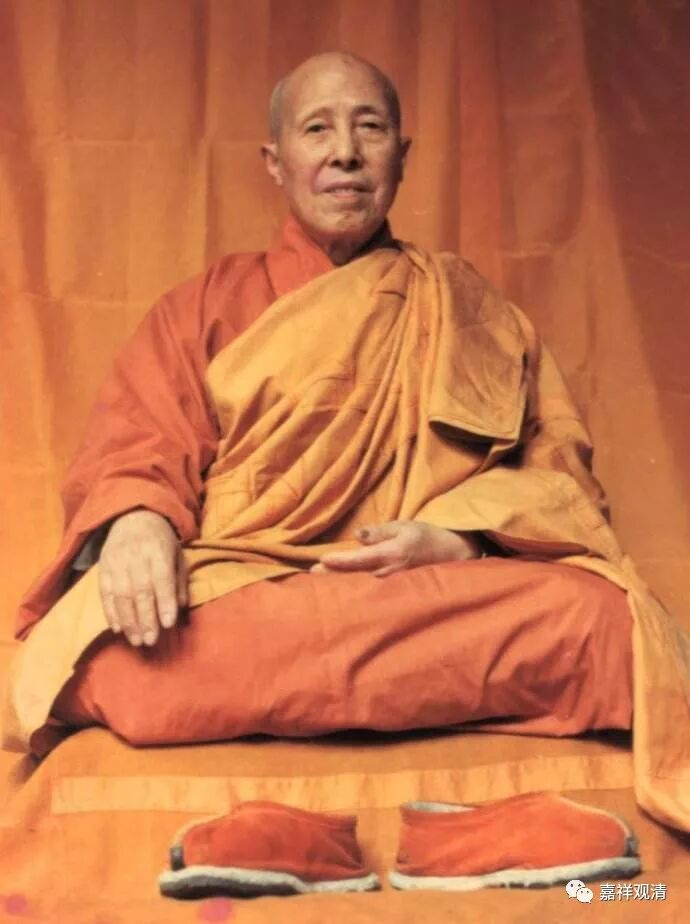

##  《菩提速道》035（中） 

比如 清定 上师，我的很多朋友们当面碰到过他后，都对他生起不可抑制的信心，为什么呢？就是好处太直接了嘛。 清 定上师碰到每个人的时候都给他摸顶，而且又是来真的。平时西藏人摸顶的时候也就是意思意思，把头碰一下，而 清 定上师是来真的，他禅定功夫又特别好，因为在监狱里面打坐了几十年。他也没有去过西藏，不知道人家摸顶实际上是意思意思。他就来真的，把两个手都放到每个人的头上去，好像真的灌顶一样的感觉。我的那些朋友们，每一个人都跟我讲过，最差的也有从头到脚被醍醐灌顶的感觉，好像真的有水灌进去一样 ——“噌的”一下子，浑身 一麻，过电一样 。 

有了这种感觉以后，他会对 清 定上师没信心吗？不可能的！绝对有信心的！哪怕你让他坐监狱，逼他嘴上说对 清 定上师没信心，但他心里面肯定有信心的。因为这种感觉太实实在在了 ——两只手往你脑袋上一放，“哐当”——从上往下，“ 咣当 ”一下，好像水进去一样，这种感觉太直接了。主要是 清 定上师也没去过西藏，他不知道那些活佛摸顶仅仅是手放到头上意思意思的，他就给你来真的。 

大家可以想象，在三、五百年以前，当时的很多活佛们、格西们在闭关之后都达到这种水平的，那他们一跑到江湖上灌顶的时候，大家能没信心吗？再往前想，两千年前碰到释迦牟尼佛的时候，那直接就傻眼了。 现在 ，你要让我们对着一个虚无缥缈的大师来崇拜，还是很难的 ， 如果 有的话， 多半是催眠了自己 。 

嘴甜的人，像徐志摩这种人，会说 “许你个未来”——将来怎么怎么样。如果所有的上师都许我个未来，我还是不知道什么时候能够完成啊！“如果不相信嘛，他也 “ 许我 个未来 ” 了 ；但是 相信嘛，又不知道什么时候能看得到。下辈子是不是会有，我还不知道，怎么办呢？”如果上师不是许我一个未来，而是直接拿两块金子： “哇！这个上师好人啊！”所以，现在王思聪能够成为国民老公的主要原因，不是他长得帅，而是他是首富的儿子。我们的信心其实都是看眼前的，眼前的好处越多，我们就越能够产生 “ 信心 ” 。 

