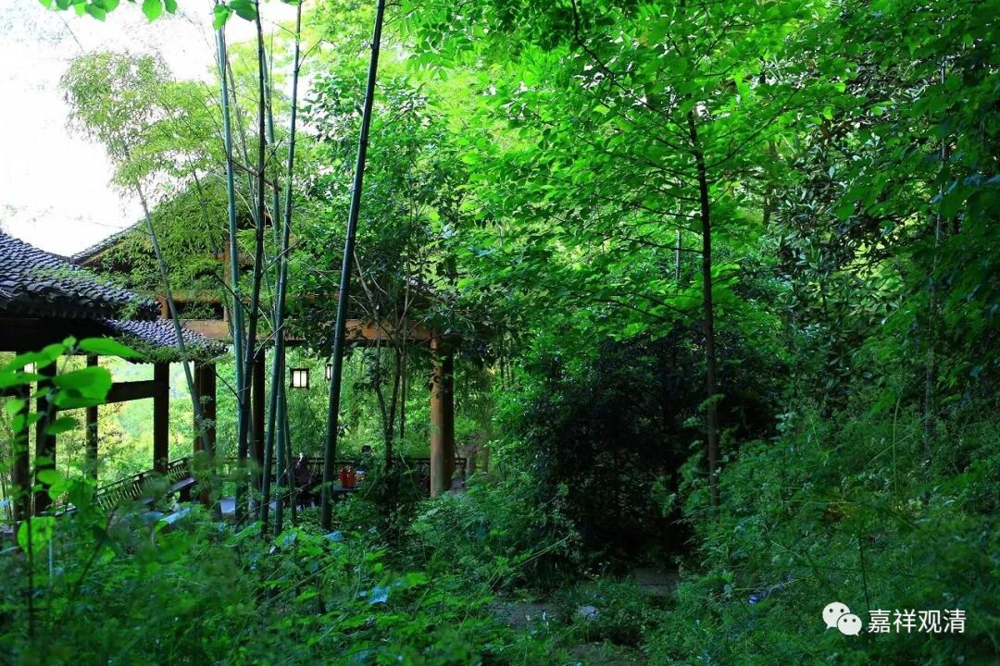

##  《菩提速道》035（下） 

《掌中解脱》里面有个故事嘛？有一个 管家 背着很多米跑到山上去见 大师 ，心里一直在骂，结果 上山以后，师父对他非常客气，还 给他吃了 难得的食品 ，他立即就改变了想法： “啊！好师父啊！”其实释迦牟尼佛早就讲过了，这叫“先以欲勾牵”——他想要什么东西，就给他一点。但是在这些方便的背后一定要有智慧，要有实际的东西 ， “后领入佛智” 。阿底峡尊者也说度众生的时候要先有神通， 有神通， 你让他实际看见了，他就不能不信了，就是迷信的话，他也信了。 

所以小张做的一个调查结论可以放在这里用：“大家都是需要迷信的！”你要让他看到 眼前的东西 。如果看不到 眼前的利益 ，怎么办呢？就可以这样，比如海涛法师的《我的学佛经历》、传喜法师的《我的学佛之初》、净空法师的《我是怎样学佛的》 …… 连 太虚法师 都有 的《我的两次宗教体验》 ——大家讲来讲去都是在讲这些嘛。我也准备要写了（哈哈哈，开开玩笑）。 

关键就是，你不能许他一个空的东西，你要让他一想到你的时候，就有具体内容 ——故事、形象 。就像昨天我们讲的，西藏的这些名字对我们来说很枯燥 ——根敦嘉措、根敦珠巴、绛央 协 巴、绛央嘉措 …… 也没有具体的内容。如果你一旦把这些名字里面灌上内容，这个名字就活过来了。大家就能够想起来他是干什么的 ……比如 想起太虚法师的两次宗教体验 ——一次唯识、一次中观，如何如何。或者像我们这种比较刻薄的人，一想起海涛法师，就想到他是从基督徒转过来的， 呵呵，你就懂他 为什么把佛教搞得这么荒腔走板了。 

**“产生功效最胜者，惟上师乎！瑜伽士！”**他 就 真的不是一般的上师 ， 必须是符合善知识各项条件的才行啊 。 

**“莫觉巴说：‘仅靠勤苦地修行获得解脱，对此犹存疑虑；若能敬信上师，那么解脱就无庸置疑的了。’”**那么这段话里面的 这种上师 ， 都不是一般的上师 。 这段话如果翻译成现代文 ， 就是 ： 尽管我傻 ， 但是我有师父 ！ 

**“又说：‘观音菩萨若是白色，就让他是白色吧！金刚瑜伽母若是红色，就让她是红色吧！欢喜金刚若是蓝色，就让他是蓝色吧！反正不管我住在哪里，从没与上师的显现分离过，对于一生成佛，现在似乎已稳操胜券！’”**我 不知道译者是如何具体 翻译的 ， 我们可以解读为 ：反正 他们都是我的师父 化妆的，长什么样子 我也不管 了， 不管我在哪里 ， 反正就是他了 ， “ 从没与上师 的 显现分离过 。 ” 他们都是上师的显现 ， 一会儿化 现 成白颜色 ， 一会儿化 现 成蓝颜色 ， 一会儿四个手，一会儿俩胳膊 ……反正都是您的加持了！ 如果 是我的话 ， 就在闭关房里 面 贴 个 条 ——“ 师父， 别玩我，反正是你 ，收了神通吧 ！ ”

