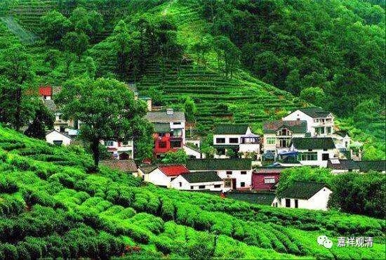
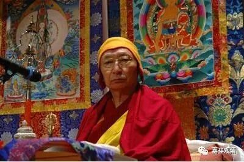
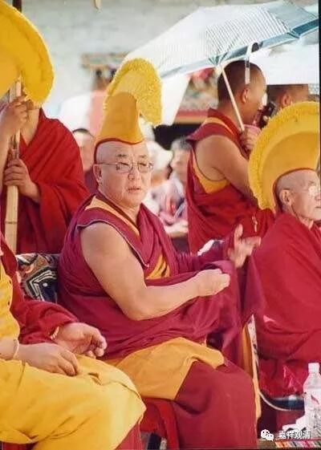
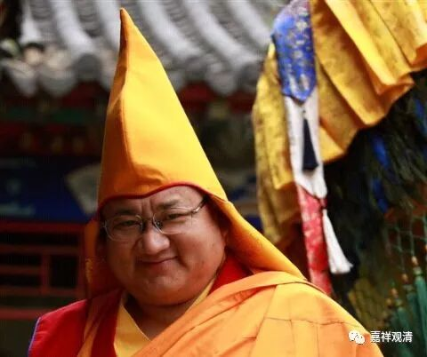

##  《菩提速道》036（中） 

**“上托钵盂，甘露盈满，披著褐黄色法衣，顶戴金黄色的班智达帽，相好庄严，以澄净的光明为体，”**再过几十年，我们汉地是不是要戴 太虚帽了 ？就是一般的那种，和伊斯兰教的帽子差不多，只不过伊斯兰教是白颜色的，我们是咖啡颜色的。而西藏是戴 班智达帽 等等（他们帽子种类很多） 。 

现在也有很多 冒充西藏活佛 的， 不懂规矩，帽子乱戴，甚至 戴的帽子都 有 白无常的帽子 。 他不懂嘛 ， 没见过实物 ，就搞个白无常的帽子戴着，真是 特别有趣 ，一看他们 出 来 ，知道的那是骗子 “ 传法 ” ， 不知道的还以为 两排 鬼 出 来了 。（没找到照片。） 

**“金刚跏趺，安坐于自身所发的光蕴之中，”**全都是光 ， “光蕴”，就是光的聚集 。 “**心间有释迦牟尼佛， ”**上师善慧能仁金刚持，这里心间的释迦牟尼佛就是能仁**。“释迦佛的心中是金刚持佛。”**“金刚持佛”， 这里有个 个概念，就是法身佛的概念。如果在汉地的话，法身佛的意思肯定不是用金刚持佛，而是用毗卢遮那佛，是吧？ 

**“上师右边的莲瓣上，是大威德金刚诸天众等，左边的莲瓣上是胜乐金刚诸天众，前面的莲瓣上是密集金刚诸天众，后面的莲瓣上是欢喜金刚诸天众等环绕。”**这里的 “诸天众” 的 “天” ，都应该理解为 “ 第一义天 ” ，就是佛 （ 菩萨 ） 们。 

**“其下一层的莲瓣上有时轮金刚、黑阎摩敌、红阎摩敌等无上瑜伽部的诸天众围绕安住。**

**再下一层为普明大日如来等瑜伽部的诸天众围绕。**

**其次为毗卢遮那现证佛等行部诸天众围绕安住。**

**其次为能仁誓言三尊等事部诸天众围绕安住。**

**其次有贤劫千佛、三十五佛等围绕安住。 ”**一般就是观想三十五佛加上药师八佛 …… 贤劫千佛就太多了。 

**“其次有八大菩萨等诸菩萨众围绕安住。**

**其次为十二缘觉等围绕。 ”**这个 “十二缘觉”的出处在哪里？有人去查过吗？我怎么从来没有见过呢？这个恐怕又是密宗的法里面提到的。 

**“其次为十六罗汉等诸大声闻围绕安住。**

**其次为勇士空行圣众围绕安住。**

**最下为诸护法众围绕安住。 ”**

