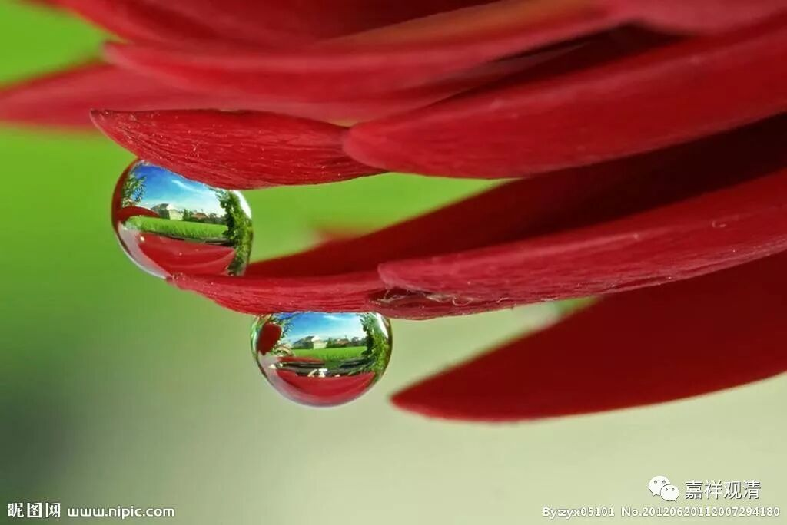

##  一花一世界，一叶一如来 

##  ——威廉·布莱克&宗白华、牟宗三和徐志摩 

师父常说： “不学华严，不知佛法的富贵。”我有点分不清，这里的“华严”，是指的“华严宗”，还是《华严经》？《华严经》里描述的境界，重重罗网，美矣灿矣！华严宗之六相十玄 ，钩沉阐扬，圆融自在 ……

《华严经 ·普贤菩萨行愿品》说：“ 一尘中有尘数刹，一一刹有 尘数佛。 ”果然无尽延伸……华严长者李通玄则有名句：“十世古今，始终不离于当念；无边刹境，自他不隔于毫端”，可谓玄之又玄，众妙之门。 

     ×                     ×                  ×                   ×

曾在上海的地铁车厢里，看到一首诗，很有华严境味……

一粒沙中幻出一个世界 

一朵花里看到一座天堂 

把无限放在你的掌上 

把永恒在一刹那间收藏 

中译者为宗白华先生。诗的原作者是威廉 ·布莱克，原诗如下： 

To see a world in a grain of sand 

And a heaven in a wild flower 

Hold infinity in the palm of your hand 

And eternity in an hour 

后来读牟宗三先生的《宋明儒学的问题与发展》，原来牟先生也译了这诗，相对宗白华先生的译本，牟译比较接近直译些。 

从一粒细沙看世界 

从一朵野花窥天堂 

以你的手掌执持无限 

以一小时把握恒常 

再后来又发现，与上两位算同时代而更有名的徐志摩，也译一个版本： 

一沙一世界，一花一天堂。 

无限掌中置，刹那成永恒。 

一首英文小诗，三位大师传译，味道也各不相同。 

  以前在 “琉璃工房”看到一个作品，感觉很适合用这首诗作注脚。 

