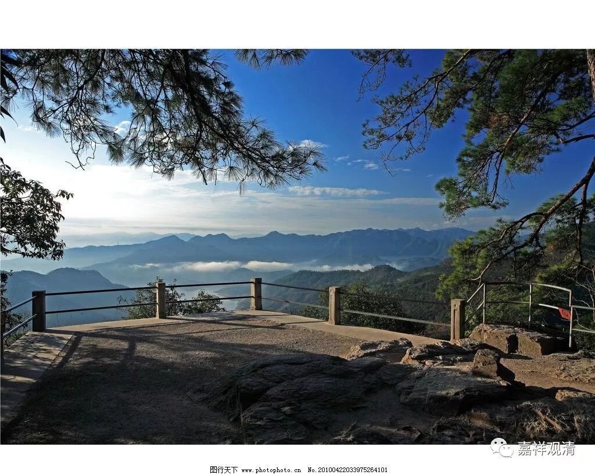

##  《菩提速道》040（下） 

**“‘涂香’指芬馥沁人肺腑的香水、香膏等。‘伞盖’指华美的宝盖。‘灯烛’指供养芳香的酥油灯等，芬芳而明亮，以及夜明珠等，”**你看到没有？夜明珠派这种用处的 ——照明 。**“光明普照，似乎不能分辨昼夜。‘薰香’指配制的合成香，”**现在巴丹师 （八吨红木的巴丹师） 也在配香。他挺钻研的，说在熏香里面用汉文翻译过来叫 “郁金”的，实际上是红花。我听他说的 很 有道理 啊 ，因为郁金是球茎类的，藏红花也是这种球茎类的，所以当时很可能就把这个词翻译成郁金了，所以藏香的味道是因 这类（配错药）而 有点特别的。 

还有一点，藏香在我们闻起来 有点 冲鼻，什么原因呢？我觉得他讲的也是有道理的。因为藏 地相对 是缺氧的，在他们那里 的 一点点氧气烧出来觉得比较一般的香，在我们这里相对富氧的环境下，那肯定味道是重的。那些喜欢西藏的文青们就像追风一样去追风西藏的香，是吧？实际上 完全按照原方原样制作的 藏香是不 很 适合我们的，它 的味道 应该再淡一点。就是给我们汉地用的时候，应该配料还要再淡一点，再加一点添加 的赋型剂也 行 （他们不太愿意加添加剂） ，或者做得小一点、细一点。否则他们的这个香我们闻起来一定是味 偏 重的。 他们的香一般做得比较威武雄壮，太粗了，那烧起来味道也会相对有点重，相对封闭的佛堂里烧一根，鼻子一会儿就 ……。 

而且还有一点就是，其实很多香料西藏是没有的，他们就用了很多替代品。比如刚才讲的郁金这些，可能也没有， 有些小厂， 一些金银之类的 配料 也没有 放 ， 这些 就不说了。另外呢，沉香、檀香等等，西藏也不多，很少的，都用替代品的。他们那里大量的都是松脂 ——油松，所以闻起来烟味很冲。 

**“如现在传称的长线香，以及如沉香、杜若噶香等天然的纯种香。**

**‘最胜衣服’指最好的衣物。‘最胜香’为馥郁氤氲溢于三界的香水等。‘末香烧香’指可撒的香粉、可薰燃的香袋、画坛城的彩粉等。各种供品堆积起来，巍峨壮观，犹如须弥山王一般。”**意思就是 很好很好、 很多很多 的香、衣物 ，堆成一个 个 高山一样的。就是通过观想的力量，或者再念个咒，把它变得很大很大、很高很高的样子。 

**“‘庄严具’，结合在前面一切供品的后面，有量多、庄饰、种类繁多之义。”**就是有这么多这么多的好东西，非常非常多，全部都用来作为庄严 、 装饰 。 

