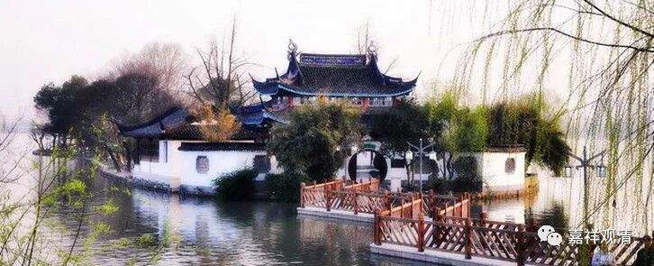

##  《菩提速道》043（下） 

**“如《集学论护善品》中说：‘断贪自异熟，则护一切善，不应生忧悔，莫宣昔所作。’”**“断贪自异熟”，就是不要对自己的身体太认真。“则护一切善”，那么一切的善品在此之上就能够将护。“不应生忧悔，莫宣昔所作”，不要生起忧愁和悔恨，别夸奖自己以前所做的有多厉害，比如“我以前怎么样怎么样”，就像阿Q了，“老子当年也曾阔过”，是吧？ 

**“总之，当依‘十方一切诸众生，二乘有学及无学，一切如来与菩萨，所有功德皆随喜’颂中所说，随念五种补特伽罗所行的善法，修欢喜心。”**每天念这个颂的时候，你可以想一想，是哪些呢？五种。第一个是一切众生，一切众生好的地方，你都要随喜。第二个是二乘当中的有学，就是初果以上的圣者。第三个是二乘当中的无学，就是声闻 、 缘觉 阿 罗汉。第四、第五就是如来和菩萨，就是大乘的圣者和大乘的无学位。就是这五种补特伽罗。 

他们所行的善法，你都修欢喜心。这里还仅仅在这里修欢喜心，如果按照本书前面的讲法， “为利众生愿成佛”，除了佛以外其他众生都是你要度的对象。也就是说，想象自己成佛，然后放光照在六道众生的身上，让他们都成佛。在这些六道众生当中，还有十地菩萨的，因为他们也是你度的对象。 

想是这么想，不过自己感觉挺惭愧的 ——老面皮（上海话）。“为利众生愿成佛”，十地菩萨当然也没有成佛，那就也是你度的对象 —— 想得自己汗都要下来了。我们虽然是这样观想，好像他们也是我度的对象，但实际上别说他们了，就连声闻乘入资粮道的 行者 ，他们所修的出离心都要比我们更厉害一点。所以自己觉得有点不好意思，三道黑线下来，就觉得很惭愧，应该要好好地修行。那么这里 “修欢喜心”就比较好，他们的功德都是我们随喜的。 

