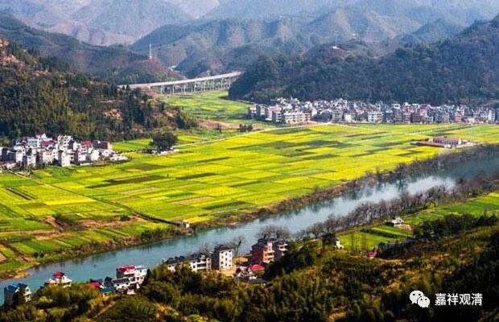

##  《菩提速道》044（中） 

**“(六)请佛住世支：**

**‘诸佛若欲示涅槃，我悉至诚而劝请，**

**唯愿久住刹尘劫，利乐一切诸众生。 ’**

**观自己化现出等同佛刹微尘数的身体，在十方世界所有欲般涅槃的诸佛世尊前，祈请诸佛为了利益一切有情，历劫乃至更久的时间常住世间，不般涅槃，然后念诵 ‘诸佛若欲示涅槃’这一颂文。”**这个呢，是可以单独挑出来的。其实观修的背景就是这样，每一段都是可以单独观修的，你可以仔细地单独拿出来观修。 前面是请佛讲经，这里是请佛住世。佛 住世的最大事业还是讲经，这样才能真正利益有情，因为有情是通过佛的教导才趋向解脱 ……所以要请佛长久地住世利益有情。当年阿难就是失去了机会而没有得到请佛住世的利益。 

**“若缘念亲对自己说法的诸位上师数数供养，祈请长久住世，实在是修习长寿法的最佳方便。”“**请佛住世 ”，在现实中，则请师父长久住世也一样的意思，有无边的功德。而且，如果 你自己想长寿的话，你就 多多 祈 请师父长寿 ——祈请师父长久住世是修长寿法的最佳方便、最简单的技巧 。供养 师父 也是一样， 所谓 四事供养 —— 饮食、 衣服、 卧具、医药，是吧？ 最基本的生活必须品：吃喝、穿戴、坐卧、 医药，包括基本的饮食、起居、医疗。 

**“(七)回向支：**

**‘所有礼赞供养佛，请佛住世转氵去车仑，**

**随喜忏悔诸善根，回向众生及佛道。 ”’**这个版本在这里应该是 略 有问题的， “所有礼赞供养佛”当中的这个“佛”字应该是福报的“福”——“所有礼赞供养福”。 《普贤行愿品》的这一颂常见的有两个版本， “ 供养福 ”和“ 供养佛 ”，前者比较正确一点。后面这个，应该是音近而误。 

这一颂里面， “普贤七支”都出现了： 1、 礼赞； 2、 供养； 3、 请佛住世； 4、请 转氵去   车仑 ； 5、 随喜； 6、 忏悔； 7、 回向。 

广的 “普贤七支”，从“所有十方世界中”一颂开始，直到“回向众生及佛道”，如果想略的思维、念诵“普贤七支”的话，那么单单念诵这一颂就可以了，这一颂里面把七支都包含了。 

