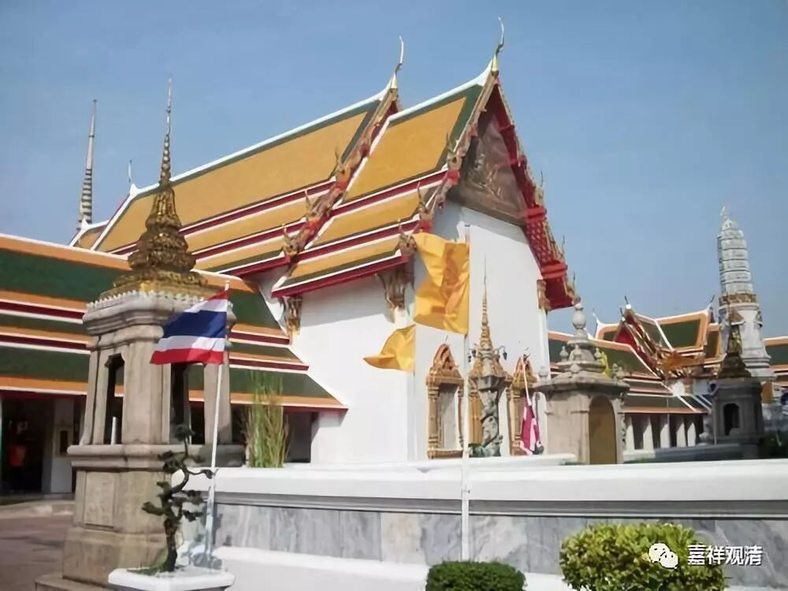

##  《菩提速道》讲记051（上） 

**“宗喀巴大师说：‘肆意於上师作毁谤等，而妄言勤于闻思修者，实为开启恶趣之门。’”**有种人对上师 做 毁谤 等 事，然后还自己说自己修闻思 很好 ，这个就不要谈了， 假的。 

**“‘如《金刚心要庄严续》中说：“若人谤上师，虽勤最胜续，舍睡眠杂乱，千劫中勤修，亦修地狱等。”’”**如果你诽谤上师，你离开了上师还说这个上师有问题、不好等等，哪怕你再努力 ， 就 算 是修最最殊胜的密续修法，你跟修地狱是没区别的，你再修也肯定是去地狱的。 

如果结合 太虚 法 师 的 话，那就 是人格都有问题了 。 “ 人 圆即佛成 ” ，人都不 “圆”， 人格都没做好，做一个好人的格局都没有，你说你能成佛 ？！ 难道有一个佛 ， 他连好人的格局都没有吗？ ！ 这个因果绝不能是这样的，绝不能说你舍弃了上师、诽谤了上师，你还能成佛 。 有这种因果的话，佛教就真的不 称 为佛教 了，佛教以后也没有办法弘扬了。 

**“另外，还说到，曾作无间恶业，诽谤正法，或犯别解脱戒四根本等的极重罪人，于此金刚乘中亦可获得殊胜成就，”**就是也有忏悔的方法，忏悔之后也可以获得成就。**“但是，若是至心诽谤阿阇黎的人，即便千劫勤修，终无任何成就，他的朋友也不会成就。”**“至心诽谤”，就是存心造恶， 这样一句话 ， 就把他周围的门全部 关 掉 了 。 “ 他的朋友 也不会有成就 ” ，我理解为就是和他一起 、参与 诽谤 的那些人 ——他的伙伴们。 一般 说起来，和他同坛灌顶的人就算的，有这个说法 ——那也太惨了。 

我们去参加灌顶的时候，一定要谨慎一点哦。我看到一些不如法的 人参加 灌顶，吓都吓死了。有些人 喜欢挤进来 灌顶， 却 连佛法 ABC都不知道的， 只是听说 “灌顶成佛快” 就跑来灌顶， 这种人要 跟我 一起参加这类法会，呃， 我 是 怎么也不会 进场 的，你就是再给我 30斤金子我都不会 去跟他做师兄弟 ——我这么财迷的人，都不会进这个坛场。碰到这种情况，你可以选择不去参加。 

