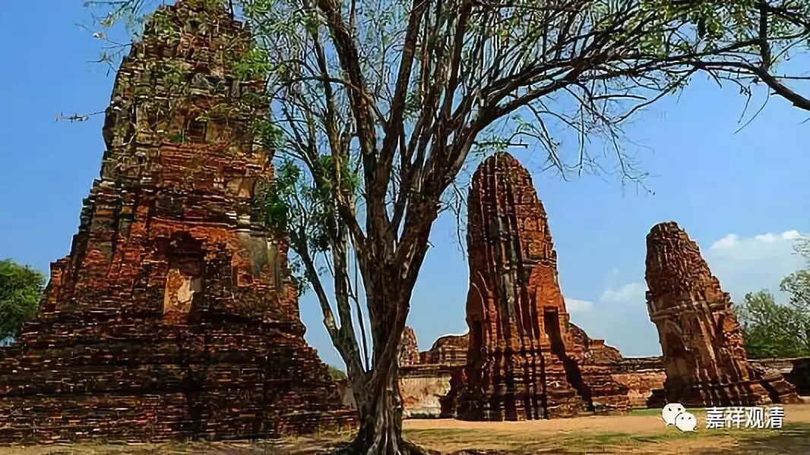

##  《菩提速道》052（下） 

**“另外，《念住经》中说：‘一切贪嗔痴的根本，即是恶友，犹如毒树。’”**恶友，是一切贪嗔痴的来源。 这个恶友，就 理解 来说 ， 其实 不见得真正都 指向 人， 引发贪嗔痴 的， 都可以 把它当作是恶友、恶知识。 

**“《涅槃经》中说：‘如诸菩萨，怖畏恶友，非醉象等；此唯坏身，”**菩萨怕遇到恶知识，对 “醉象”等并不太担心。（醉象，就是疯了的大象。）“ 醉象 ” 呢， 唯独 坏你的身体，也就是最多把你踩死。**“前者俱坏，”**前者 ，恶知识， 却既能坏你的身，也能坏你的慧命。把你扔到地狱里面去的就是这个恶知识，当然还有你自己随顺恶知识的心。 

你真的要说的话 ， 应该是外因通过内因起作用 —— 马克思讲的非常好 ， 这个就是缘起论啊 ！ 你不能只怪对方，对吧 ？ 即使有外因，你自己内因不起作用也没所谓嘛。马克思菩萨，他有好几个观点我都很 接受 的。比如 ， “ 人是一切社会关系的总和 ”， 说得多好啊 ！ 人是什么呢？他就是 这些社会关系 ——大家共同认同的这样一个人 总总 社会关系 —— 的总和。 

他 还说 ， 我们现在 这些 繁荣的背后是自私，现代经济学是建立在自私的背景下的，马克思说这个是有问题的，这个 “ 贪 ”的 背后是会造成崩溃的。我们前两年不就是因为金融大鳄们的贪心，导致 金融危机， 整个世界的经济都出现大的问题吗 ？ 马克思是菩萨来的吗 ？所以把他的画像挂在那里，大家都礼拜嘛。 

而且他拒绝经营，是吧？他炒股炒得很好啊，但后来他不炒股了， 花大力气 写了《资本论》。 他真的很伟大，他预言了世界的发展，今天的机器人技术、 AI的发展、大数据的运用……如果能加上教育的推广，贪嗔痴的对治，那我看共产主义——各尽所能、按需分配——就会以科学和社会、人心进步的方式实现了！ 

