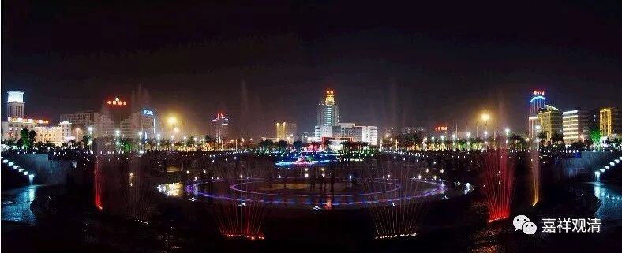

##  《菩提速道》054（下） 

**“另外，诸佛还会应我们各自的善根示现种种身形**， ” 诸佛的各种化身 ， 大家都知道的，各种各样都可以，诸佛可以化成这个，也化成那个，对吧？ 但是，化身你肯定不认识，认识了你就赚了 ……

**“如《宝积经·父子相会（品）》中说： ”**《父子相会经》，专门有这样一部经，它也是《宝积经》的一部分。 汉地也有这部经的单行本。 

**“‘或现释梵王，亦或现魔相，**

**饶益诸有情，世间不能了。**

**或现为女人，亦或现畜生，**

**无贪示有贪，无畏示恐慌，**

**无痴痴呆现，无癫示癫狂，**

**体非残示残，变化种种相，**

**调伏诸有情。 ’”**

就是说诸佛会显现种种有情的真身。那么就又有点累了，前面一页刚刚说要远离恶知识 、佛示现师长相， 这里又说诸佛会显现种种形象。那 这种种形象，教我们 怎么判断 真假 呢？作孽啊！所以我就说，你在闭关的时候就在那里挂个牌子 ——“佛啊！不要玩我。”

**“所以，祈求上师天加持我及一切慈母有情，将这些善知识视为真实的能仁金刚持！”**

那么，我看不出来、分辨不出来怎么办呢？之前我们说过， 在自己能力不够的时候，不要忘记祈祷、不要忘记还有 “求加持”这种操作。 

对了，有句话要说一下。我喜欢开玩笑，也说过相声（拿了一堆奖的事我会说吗？！），课堂气氛我希望轻松一点，所以我在这类课堂上 我在有些地方是开玩笑讲的哦，给你们启发启发，不一定对啊，你们千万不要当真了。特别是网络上听课的，别把这些话都当真哦，启发启发开个玩笑，让你们自己回去有点想法而已。 

