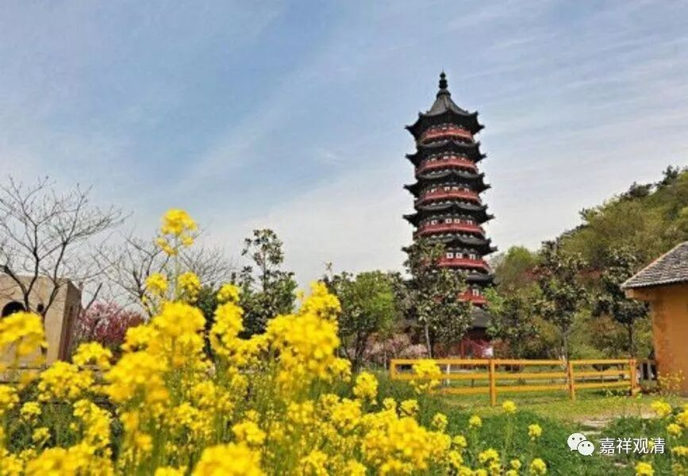

##  《菩提速道》061（下） 

**“有着如此之大的恩德，自己若无随念大恩的恭敬心，那我实在是卑鄙下流之辈。”**

师长于我有恩，我当生恭敬之心；如果基础的感恩心都没有的话，那 我 真的 不是东西 —— 就是这样的意思。 

**“如《龙王鼓音颂》中说：”**

啊？ “我不是东西”也有授记的？ 

**“‘非山非厚土，非海为我担，**

**背仁负恩义，为吾最重担。’”**

就是说把山挑起来，把地挑起来，把海挑起来，都没有我忘恩负义的事多。看样子佛对我们授记过的 ——这个以后会是我的一个梗。 

**“萨伽班智达曾说：**

**‘报恩为贤者，负义下劣人。’”**

懂得报恩的人，他是好人。忘恩负义的人，那是卑劣的人。报恩总是要念恩的，有念恩才会有报恩。负义就是从自己的角度出发，就是他认为别人对他的好都是有目的的。 

**“戊四、加行依止法：**

**清晰观想诸善知识住于面前，在此清晰的状态中，如是思惟： ”**

先清晰地想，哪怕你想想概念也可以， “某某师父曾经对我怎么样，给了我20万”。 

我碰到过一个事情，就是有一个兄弟，也是出家人，在东南的某个省内做一个小庙的住持。他拜了某位法师为师父，我知道了后就对他说： “你这位师父在江湖上很有名啊！是绿教的，带绿帽子的。”你们都知道“绿教”是谁哦。我就说：“你怎么跟他学啊？”我兄弟回答说：“他捐了40万给我造庙，我就拜师了。”他的逻辑就是：不是这位法师的水平有多高，是因为他给我捐了40万造大雄宝殿，所以我就拜师了。 

我们格鲁派的教授里面不是也有这样的故事吗？就是有一位头等格西，他从拉卜楞寺去到拉萨的三大寺学习，然后学成头等格西再回来，而且是当时水平相当高的一位头等格西。他学成以后并没有在三大寺留下来，而是回到了拉卜楞寺。但是呢，这两个地域相隔还是非常远的，所以他在三大寺的名气拉卜楞寺也没人知道。等到他获得头等格西回来以后，他讲经根本就没人听，也没人拜他做师父。 

然后他就去了蒙古，在大概 二、 三百年前的时候，蒙古对于西藏来说是非常富裕的地方。这些蒙古的王公都获得清朝大量的赏赐，而且他们都是信佛的，一旦你去了蒙古，供养也会很多，有些还可能会成为蒙古的国师等等。这位头等格西去了蒙古之后，弟子就很多，有大量的金银的赏赐或者供养。后来，他又回到了拉卜楞寺，那个时候他的名气就起来了，他讲经的时候弟子也非常多。 

他有一次在讲课的时候就说： “其实你们不用拜我，你们真正应该拜的是金子。在我没有金子的时候，你们听课的人一个都没有，在我有了金子以后，你们都来拜我了。”

