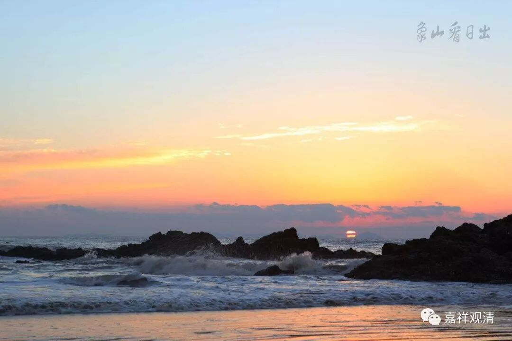

##  《菩提速道》067（四） 

**“（观待现前义大）**

**我们所获得的这个暇满人身有着极大的意义，依靠它，可以修习布施、净戒、安忍、精进等善因，以成办增上生中圆满的身受用眷属等。**

**还可以修习福田、意乐、事物、所依、时间等诸大力门。 ”**

那么， “有暇”已经有了，然后我们又具备了可以修行的“质料因” （ 最近讲因果比较多 ） ，就是有了我们这个身体 ， 可以去修行，如果没有它，你就不能修行，对伐？特别是像密宗里面讲的，你有了南瞻部洲的六界具足的胎生的人身，那你就具备了修无上密的质料 ——条件。如果你不是南瞻部洲具备六界的胎生的人身的话，你连修法的基本条件都没有。今天我们这个条件是有的，但接下去，是不是浪费了呢？ 

**“其中依此暇身能修福田大力门者：假如把被剜去眼睛困在监狱中的十方一切有情，从狱中解救出来，施与眼睛令重见光明，并安立他们于梵天大乐，然而这一切功德，尚不及以信敬心瞻仰一位菩萨的利益功德大；”**

就是眼睛盯着他看，像花痴那样 ——“以信敬心瞻仰一位菩萨” ，这个功德更大！ 你可以质疑嘛，我没有讲毋庸置疑哦。 但这个，至少现在正反方都没办法用理性证明，那就先放一边。 

**“供养一切菩萨，不如供养佛一毛孔的利益功德大；供养一切佛，却不如供阿阇黎一毛孔的利益功德大。这些事情，现在就可以凭这个身体来修习。”**

如果这样的话，只能说这个是方便说， 它 不是究竟说。如果究竟说的话就会出现一个问题，可以出现一个反推 —— 我的阿阇黎不是佛。因为供养我的阿阇黎的一个毛孔比供养一切佛的功德要大。按照这个反推的话，我的阿阇黎就不是佛。也许 修行 高，但至少不是佛。 因为我供养了，现实看起来好像果报没那么大嘛 ……

所以，只能说这是一种劝善，或者是一种方便说，它不是究竟说。或者对于特别功利化的人来说，他就只供养阿阇黎。实际上你应该这么说：上面班禅大师坐在那里讲经的时候，下面坐着三万个人或者几千个人，大部分人能达到 “功利行”已经不错了，因为大部分人学佛都是“自然 型 ”的。 

在西藏，大量学佛的人 最初 连功利都没达到，他是自然的。为什么出家呢？我哥哥出家了，我的四个哥哥全出家了，该轮到我也要出家了。或者，家里人认为： “这八个孩子当中，至少要出家六个吧？”从他小的时候就让他出家了。隔壁邻居啊等等也全都是这样的，大家都出家了，所以他也出家了。他是一种自然的行为。有功利心的已经很不错了——我要去成佛，哪怕这个佛和他真正理解的佛已经完全两回事了。我要去成佛，所以我要出家——这个对藏 人 来说， 最初如果是这样的话 已经很难得了。 

大部分人想要达到道德的学佛的程度，都是要在学习道次第以后才会有。我碰到过很多和尚，包括格鲁派的都有这个情况，他们真正发起学佛的心是在听了善知识讲解道次第以后。只有在那个时候，他才想到： “我要好好学佛。” （ 当时眼泪下来了 …… 可是两年以后还俗了。 ） 就像我们从小上学是自然的事情，而爱学习是到被老师夸得心花怒放的时候，突然之间觉得： “学习是我应该做的。”

我很明显地看到，我们实际上也不是主动的。有一对夫妻，他们的孩子真的是被他们夸出来的。 “哦哟！我们的孩子很喜欢看书啊。”这个孩子就真的很喜欢看书了，天天在那里看书。一早上五点钟起来，一边葛优躺，一边看书——《尼尔斯骑鹅旅行记》。 

是不是师父也应该夸 “我的弟子都很爱修行”？ “ 魏老师很喜欢修行啊！魏老师是我们这里禅定第一！ ”这样 被夸 ，学生 都不好意思不修行了吧？ 

