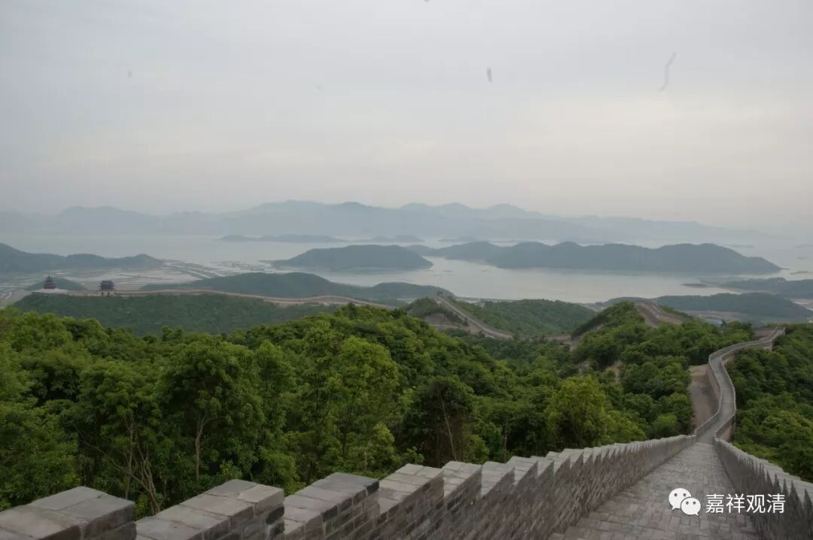

##  《菩提速道》070（中） 

**“（三）从数量方面来思惟难得：**

**三恶趣中畜生最少，饿鬼较畜生多，地狱的有情又较饿鬼多。 ”**

这个只能说是现在的情况 ， 不是一直都有的情况 。 因为最初有地狱的时候 ， 地狱的有情是很少的 ， 最后快要没有地狱的时候 ， 地狱的有情显然也是很少的 。所以这里讲的 这只是目前的情况 。 

就是最初从天道开始，慢慢地才有了人道。有了人道开始，做错事了，就开始有畜生道、饿鬼道和地狱道。刚开始出现地狱道的时候，显然那也就是三五个。到了最后，所有的地狱、饿鬼、畜生都慢慢慢慢地都开始 往善的方向努力 ，都开始做好的事情，那么 慢慢慢慢 下面的三恶道就没有了。再往后，上面的欲界天也没有了，然后初禅也没有了，二禅也没有了，三禅也没有了 …… 就是这样。所以，只能说是我们现在这个的时候地狱道比较多。 

**“畜生中的大多数住在大海中，只有零星的少部分，住在人间和天界。”**

我觉得这一点和我们现在的科学观点完全一致 ，大海里的生物太多了。 陆地上的动物和海里的数量差得不是一个数量级了 ……

**“然而，全世界的总人口，还赶不上夏季飞舞于野石榴丛中的蜜蜂数量。”**

这个 好像 有点想多了吧 。 那个时候的全世界人口还是稍微少一点的 ，但 现在还是蛮多的 。 

其实 这是我经常碰到的一个问题 ， 就是经常会有不信佛教的人来问我 ： “你们佛教讲六道轮回，现在不是人越来越多了吗？”其实这个问题还真的不容易用一两句话讲清楚。他是希望找到你的疑点，你回答不出来，他其实就走了。你的意思是把他拽下来，然后好好聊聊人生。可是他不跟你聊的，而一两句话又很难跟他讲清楚。你说有六道，而且每一道里面都有很多 blablabla ，他是不接受的。他本来就不接受这个观点，才来问你这个问题的，所以真的是很难一两句话讲清楚。 

**“因此，我们获此一次极为难得又具有极大意义的暇满人身，不要无意义地将它浪费了，应当用它获取心要。”**

就是把 暇满人身拿来 换好的东西 ， 换取佛法的心要 ……不能 像做生意一样失败了 。 

**“获取心要的方式者，必须不离依止上师天，修习所示的殊胜大乘教授心要，由此一生即可容易地证得佛陀的宝位。”**

这个就是不断在 给 我们自己催眠 ，告诉自己 说很容易 地 可以证得佛陀的宝位 ，很 容易地可以证得佛陀的宝位 ……前提是在好的老师身边不断地进修 。 

