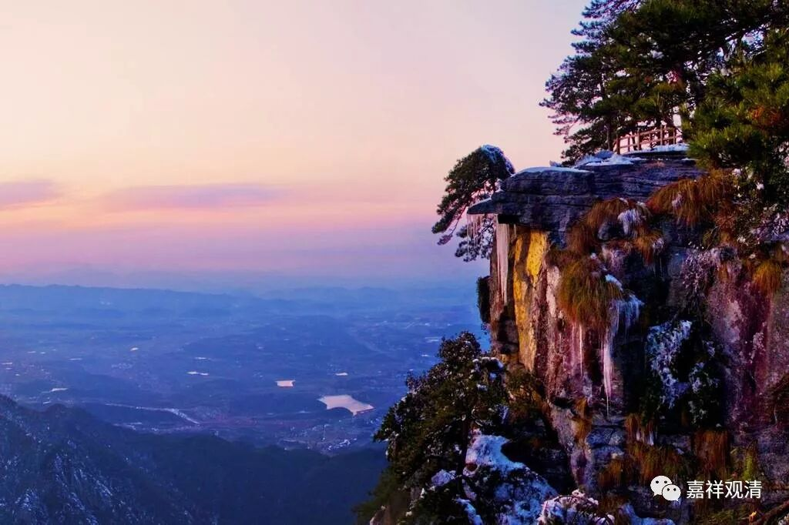

##  《菩提速道》072（中） 

**“即使神行逃匿，或施以势力、财物、神咒、妙药等任何东西也不能回遮死亡的到来，并且没有安隐之处可以快速逃遁。”**

我们都想这么做， 用各种手段来躲避死亡 …… 但实际上都做不到。 

**“如经中说：**

**‘大仙五神通，乘空能行远，**

**然彼终不至，无死安隐地。’”**

“ 大仙 ” ， 着里说的 不是东北的那种， 就是 指 能力很强的 、 有神通的人，他能够御 风 而行， “ 乘空能行远，然彼终不至，无死安隐地。 ” 但是没有 一个地方是不死的地方，这个是没有的。 “大仙们”也做不到。 

**“（二）以势力、财物、神咒、妙药等任何东西也不能遮除死亡的恐怖，”**

对于死亡的恐怖 ， 权势、财富、医药、神通 ……这些 都不能遮挡 。 

**“无论内外何缘，都不能阻止死亡临近的脚步，并且寿量无有增加，唯是渐渐减少。”**

这个 “寿量无有增加”是 从个人而言的，按照我们通常 的 认为 ，你的 寿量是固定的 ——先业所感 ， 以前的业得到的结果， 那你每一秒钟每一秒钟都在走向死亡 ， 所以说 “ 唯是渐渐减少 ”。 

**“假设以能活到六十岁而言，已满六十岁的人，死亡也只是今年现时、明日后日的事情而已；已五十的人则只有十年的光景了，如此有的人已过了三分之二的寿命，有的已过了一半的寿命 ……所剩的寿数又一年年，一月月，一天天，昼夜交替地消耗，白昼又随着上午、中午、下午而消失，上午等又随着分分秒秒而流逝。”**

时间就是这样一点点地过去 ……滴答滴答…… 。 

