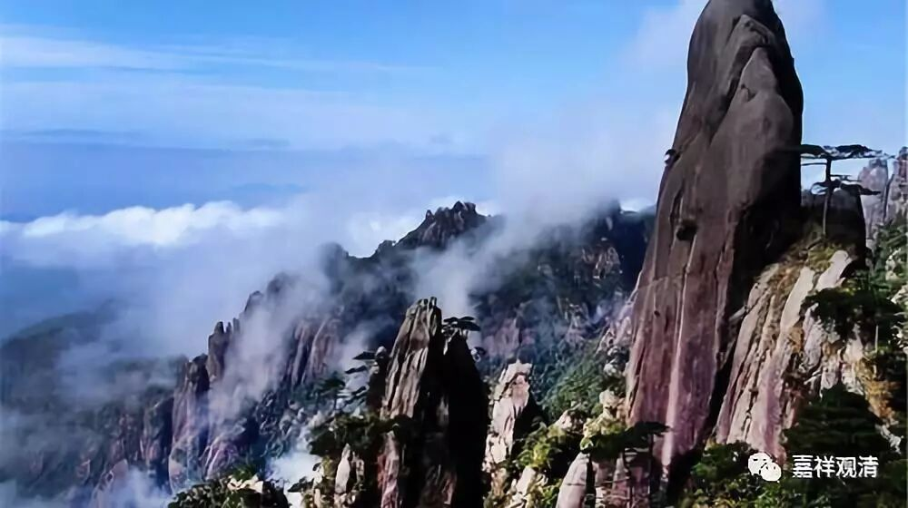

##  《菩提速道》073（下） 

佛教说，我们现在是退化 的过程 ， 佛教的名词叫 “减劫”，就是世界、人心 是不断不断地在退化。我觉得，我们通常的人比较容易理解的大概 就应该 是 “ 退化论 ” 。你看哦，我们的爹妈们觉得我们比他们差多了，我们 70后又看80后不顺眼，80后看90后像傻子，90后看00后根本就不是 正常 人 …… 反正看这个世界好像都是在不断不断地退步。这个叫 “ 减劫 ” ，是吧？ 

那么， “南赡部洲人寿量极不决定”，前面的人呢，就寿量很长，后面的人呢，寿量很短，总的来讲呢，不知道什么时候死去。 

**“现今或老年、或中年、或年少，什么时候死去，谁都没有一定的期限。”**

你们看活佛们也是一样的，有的活了很长，也有的没几岁就圆寂了，也都一样。当然，活佛们的圆寂都有背后的原因， 或者会去帮他找到原因 —— 比如说，活佛 5岁的时候就去世的话，那是 “ 这个地方肯定要有一场灾难，活佛就用他的圆寂来帮我们挡掉了这个灾难 ……” 你去看很多活佛的传记里面都是这样的，有些活佛他活的时间很短嘛，就是这个地方或者那个草原上要有一场灾难，被活佛用自己的身体挡住了。 

这个说法很有创意嘛，就是活佛怎么可以有错呢？活佛怎么可以短命呢？ 当然不是说全没可能， 但是从另一个角度来说，你也可以看，因为那个活佛上一辈子杀过人。那如果找到的 这个 “ 杀人短命 ”的 因是对的话，那他 这一世 做人已经很不错了。这种为了众生什么什么的说法，我们其实不太认同的，这个是西藏民间的说法。 我们要学的是佛教，不是民间老妈妈们嘴边的佛教 ……

**“如《俱舍论》中说：**

**‘此洲寿不定，后十初叵量。’”**

南赡部洲人的寿量是不决定的，在减劫的最后，大概是 10岁，最初呢？是无量岁。 

**“《集法句经》中说：**

**‘午前所见人，午后永不见，**

**午后所见人，明晨永不见。 ’”**

这种情况多的是，像我们到目前这个年龄，就经常会听到这种情况，是吧？比如我们的某某老师离开了，很年轻的某某人又去世了，或者有些同学某某人又去世了。 

**“‘多男子女人，少壮即已殁，**

**岂因彼年少，而言定可活。 ’”**

有人就说： “哎，一定可以活的。”为什么呢？ “ 因为年纪轻啊！ ” 别人生病的时候，我们都这么去安慰别人，大家都这样催眠自己，就说： “哎呀，你没事的，没事的，你年纪还轻呢，身体还好呢，没事的。”

然后呢，我们还有一种自信。现代人的这种执着，是以科学为自己的武器的。 “哎呀，我外婆90几岁去世的，我爷爷80几岁去世的，那我也能活得长！”“定可活”吗？不一定！ 

