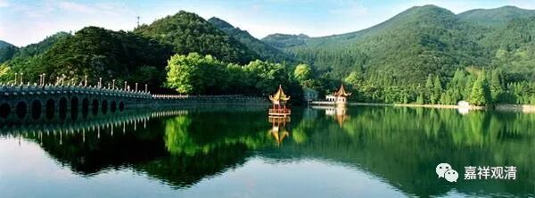

##  《菩提速道》讲记074（上） 

**“‘有於胎中死，有於生即亡，**

**有尚唯知爬，有唯初学步，**

**有老亦有幼，有当韶华年，**

**渐次皆磨灭，如果熟自落。 ’”**

这个 “ 渐次 ” 怎么样 ？依 我看 ， 虽然有很多是渐渐衰老，但 都不见得要 “ 渐次 ” 的，很多都是 突然之间就去世了。就像果子熟了以后，就自己掉下来，而果子不熟的话，被 台 风一刮，照样也全部掉下来。 

**“‘明日及后世，孰先至难知。**

**勿营明日计，当勉后世义！’”**

明天和下一辈子 ， 哪一个先到呢？不知道啊 ！ 不要主要地为了明天去做 ， 应当看 得 远一点，眼光放远一点。 

**“（二）死缘众多而活缘稀少。”**

真的，这个就是因缘，因缘就是这样 ——死缘多，活缘少 。 生缘，必须所有条件都恰到好处，但这些条件哪怕稍有改变，便是死缘。 

**“如《宝鬘论》中说：**

**‘死缘极众多，活缘唯少许。’”**

风雷水火，狮子老虎， 刀兵饥馑，天灾人祸，处处死缘； 饮食、衣服、卧具、 医药恰到好处方成活缘 ……

其实，所 有的活缘 ， 也全部 都是死缘 ——在轮回当中，根本不存在纯正面的活缘……这是轮回的本质所决定的。 

