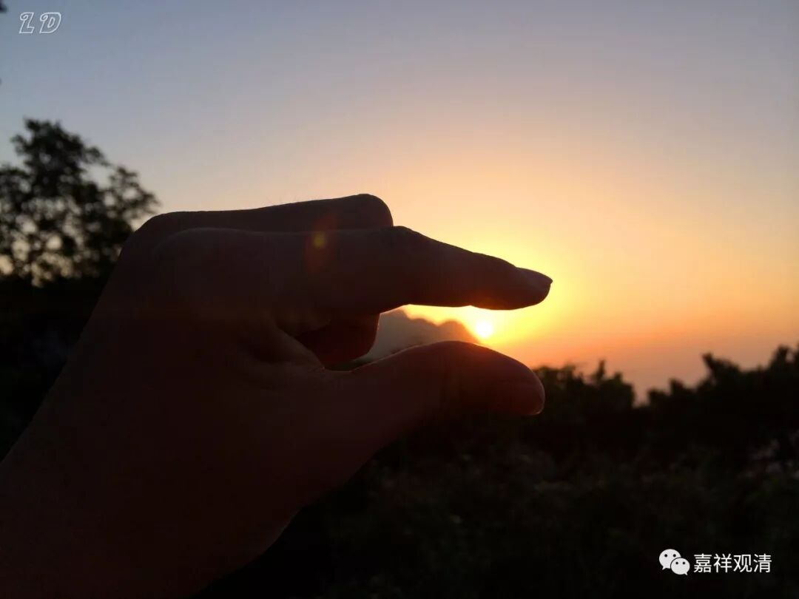

##  《菩提速道》076（中） 

**“从此再往前行是利刃布满的道路，每走一步，皮肉被块块截断。之后为剑叶林，又会被利剑截肢断体。铁刺树林中，有情攀上攀下时，被锋利的刺贯穿皮肉。还有铁嘴鸟飞落到有情的头顶或肩上，啄食眼珠。**

**紧隔着有弥满着沸腾灰水的无极河，有情堕入其中，被上下翻滚地煎煮。”**

就是很苦很苦的意思 ， 实际上肯定比这个还要苦 。 

**“壬三、寒冰地狱：**

**八大热地狱横去一万由旬有寒冰地狱。从此向下三万二千由旬处为寒疱地狱，大地皆是厚厚的寒冰，空中弥满着狂风暴雪。在这里，身体被冻得满是疱疮。**

**其下有疱溃烂地狱，这里更为寒冷，疱疮被冻得全部溃烂。**

**其下依次有口歇哳言占地狱、赫赫凡地狱，这二地狱中的有情，被冻得无法发出大的哀号声，只能从喉的深处发出阿啾啾、嗟呼呼的声音。”**

只能发出这样的声音 ， 只能从喉咙里发出 “吼吼”的声音。 

**“其下有虎虎凡地狱，狱中的有情则连一点声音也发不出来了。**

**其下为青莲花地狱，狱中极大寒风袭身，身体变为青瘀色。”**

这个 是什么呢？ 他们 的 皮肤全都裂开来 ， 像莲花一样 ， 因为是青瘀色 嘛， 所以就像青莲花一样 ，就叫 “ 青莲花 地狱 ”。 

**“下有红莲花地狱，身体冻得转青为红，裂为十瓣或者更多。**

**最下为大红莲地狱，身体冻裂为百瓣、千瓣等。 ”**

就是冻 得 更碎了 。 

我以前也曾经劝人家行善 ， 劝说一般的人就用这种方法 。我说： “ 啊呀 ！ 不要做坏事了 ， 做了坏事要下地狱的 。 地狱当中有个 ‘ 青莲花地狱 ’， 好听 吧？有个 ‘ 红莲花地狱 ’，也 好听 吧？ ”被劝说的人就 【星星眼】 说： “ 要不 就 去这个地狱 ？ ”于是 我就说在那些地狱会被冻成什么什么样子 ，他们就说： “哦哦， 那我 们 不要去了 。 ”

**“壬四、孤独地狱：**

**寒热地狱的近边有孤独地狱。《瑜伽师地论本地分》中说人间也有。如《俱胝耳山》、《僧护因缘经》中都有讲述，应当参阅。**

**生入地狱的因，总的来说，造了上品十不善业将生入地狱，尤其是作了五无间业、生起邪见、犯四根本。也有说轻慢而犯别解脱戒中的恶作罪（五篇之一的突吉罗罪），将会生入等活地狱，轻慢而犯别解脱戒中的别别忏罪（五篇之一的提舍尼），将会生入黑绳地狱。 ”**

这个和其他地方讲的 ， 又不完全一样 。 其他地方 都是 讲 ， 释迦牟尼佛的弟子们造了罪 ， 大量 地 堕入 龙 道 。 如果单单突吉 罗 罪就会堕入等活地狱的话 ，那么龙 道是怎么来的呢 ？他们没犯罪就堕入龙道了吗？其中不是有两个弟子还杀了人的吗？也堕入了龙道。所以，曾经有朋友来问我： “ 假如释迦牟尼佛 现在 在 你 的面前 真实呈现 ， 你 最想问他的第一个问题是什么？ ”我想说的是 ： “ 佛陀啊，您的那些教言里， 哪些是您的方便说？ ”

