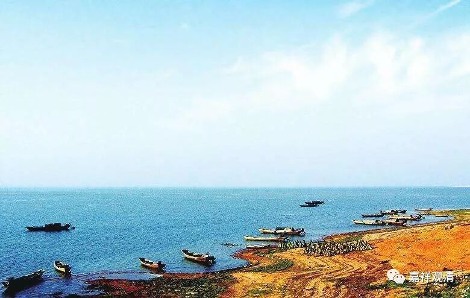

##  《菩提速道》078（中） 

比如说 ， 在很苦的地方（比如地狱） 等了三年 ， 佛菩萨 还不来 ，就是很长很长的时间佛菩萨都不来，那这个时候的心就生起了 ： “ 肯定是我错了 。 对不起 ！ 对不起 ！ 佛菩萨赶 快来吧！我错了，我真心忏悔，赶快出来吧！谢谢你！谢谢你！ ”

这时候另外的心，就再也不见了嘛。他之前可能会生起另外的心，但是这个时候 他会忏悔，会讲： “哟，我前段时间那样说，那样指责你 ， 是错的 ！ 我指责你 ，所以你 再也不现 了。 我错了 ！ 我错了 ！ 请你在我面前出现，赶快救救我吧！ ”如果这时候 佛菩萨突然出现在你 面前了 ： “ 哎呀！ 我错了 ， 我错了，把我救出去吧 ！ ”你肯定是哭得要命 ： “我以前都错了。”然后 ， 被救出来以后，又故态复萌。 

如果怎么求 ， 都不出现呢 ，那就 继续求下去嘛，你还能怎么样呢？这中间你可能会有另外 一种 想法 出现 ，但是佛菩萨一直都不出现，到 最后 你还是会忏悔 ： “我前面不应该这么说，我怎么 能 说你的错呢 ？ 你的慈悲一定是伟大无比的，只是因为我的恶 业 而不显现，请你马上在我面前出现吧！ ”就是这样。 

你看看我们世间上的 情况 就是这样的 ： 战争就像地狱一样，真的是像地狱一样，自己都不知道自己的命在哪一颗炮弹下就结束了 。 即使你是躲在哪个战壕里 面 ，或者躲在什么地方，可现在的科技这么先进，哪怕你躲在地下三米，卫星都能找得到 。 

你看海湾战争的纪录片里面， 伊拉克 的部队，在这战争里边，都不知道什么时候死，就一直祈祷啊祈祷。这个时候，突然之间美军出现了，那感觉就是： “这个是救 怙 主啊！ ”然后就跑过去，抱着美军的手在那里亲，抱着他的大腿在那里亲。美军被搞得很糊涂：“怎么回事？这不是我们的敌人吗？”

你们去看看海湾战争的片子，就是这样的。你看到他们出来的时候，看到美军感觉就想像看到亲爹一样，跑过去直接跪在地上。这个时候安拉没用的，他们直接拉着美军的手，就在那里亲啊。因为他们 知道 ，美军 能救他们了，知道美军在身边的话，导弹肯定不会再过来了 ，而且知道下一顿就有吃的了。结果呢，美军听不懂他们那些话 ，不过一看这样子就知道，打服了 。 

所以你想像一下，如果这个时候是佛菩萨出现在你面前，那你不知道会怎么样了。你哪怕是看到狱卒，都会觉得亲密无比： “我错了啊！”然后肯定是，抱着他的腿在那里亲。 

