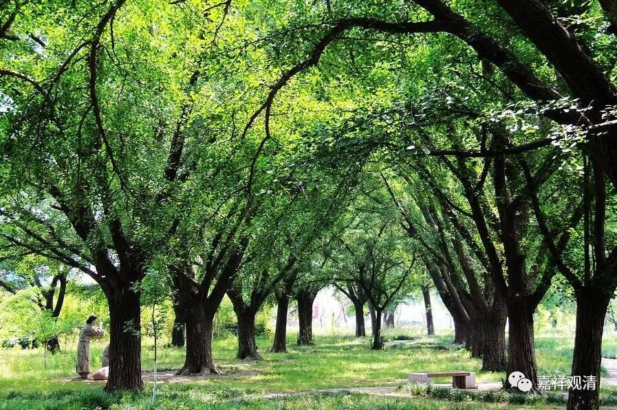

##  《菩提速道》083（中） 

**“（四）造已不失：**

**如果造作了善恶二因，并且没有对治它的话，所造的业不会失坏。如经中说：**

**‘纵使经百劫，所造业不失，**

**因缘会遇时，果报还自受。 ’”**

哪怕时间再长 ， 只要你 没有对治过，那么， “所造业不失，因缘会遇时，果报还自受。”但这里面有一句话要注意——“并且没有对治它的话”，也就是说，如果对治它的话， （预期的） 情况就会发生改变。可是，绝大部分人是没有对治的，所以后面的果报就是这样 （按预期的） 会发生。 

我的一个 出家的 兄弟曾经在漳州漳浦，被一帮知识分子居士给折腾得很惨，当时我并不知道这个情况。有一次他就请我过去给这些居士讲经，那我就过去讲课了。后来我才发现 那 根本不是讲课，明明是考试嘛。因为我那兄弟对付不了他们，就暗自思忖： “嘿嘿，我应该请观清师来收拾他们。”所以他就把我请过去讲经。 

实际上讲经的时候呢，对这帮居士来说更重要的是他们来考验我，来问问题。他们觉得是给我挖了一个 个 坑的，是什么呢？就 有 这个关于因果的问题。 

“有因一定有果吗？”他们是以这个设定来问的。 

于是我就回答说： “不是这样的。”

哇！这下完全炸锅了，一下子就炸锅了。 “这个师父实在是 …… 居然连因果也敢违背！ ”他们简直是咬牙切齿的，有几个直接就炸起来了：“这个是邪师。”

我说： “前面我讲的你们都没听清楚啊！我已经讲得很清楚了。”为什么呢?有了因以后，假如我进行对治的话，你们所期望的这个果不一定会产生的，因为它已经被对治了。 

其实佛教里面真正讲的是，有果必有因。这个果产生了，一定有和这个果相应的因。但是在这个果还没有产生之前，连这个 “ 因 ” 的名字都安不上去啊！它是哪个果的因啊？因果是相待的嘛。 

我们如果要讲非常正确的废话的话，应该是：因是这个果的因，果是这个因的果；果出现了，可以肯定它前面是有因的，果是因的果。但是在这个因相应的这个果还没有产生之前，它是谁的因呢？那是根本不能说的嘛。只是基于我们的经验，预设了它会有一个什么样的果。 

所以说，有因是不是一定有果呢？假如你不对治的话，会有 预期的某个 果。假如你对治的话，不一定 是那个结果 啊。那么真正来说，有因一定有果吗？这个答案是需要讨论一下的，是要加字的，没有对治它的话，那就如何如何，这儿也写着呢。 

那个时候，有几个人都蹦起来了。最后，另外还有个比丘尼师父在那里打圆场，但是她的打圆场也说得不对。后来我就问我那个兄弟了： “你给我吃药啊！其实这些人根本不相信你，他们自己有一套的。我来讲课他们也不听的，他们只是准备来考验我的。其实因果的道理我前面刚刚给他们讲过啊。”他们就是带着自己的想法来批评，而且还少看了一句话——“没有对治的话”。 

