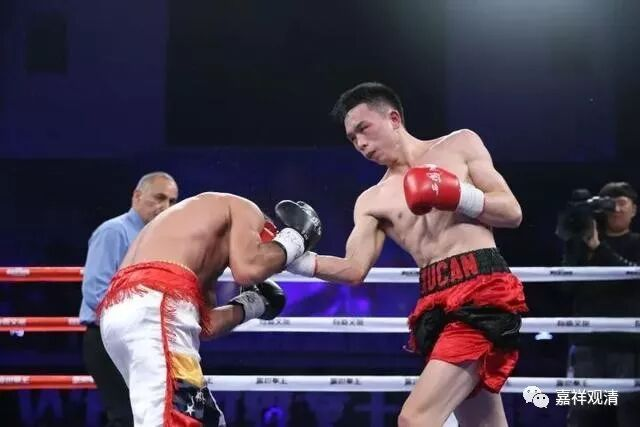
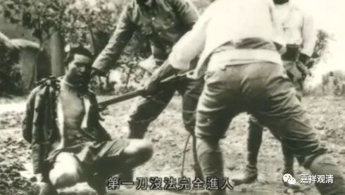

##  《菩提速道》088（上） 

我们昨天关于 戒律的问题讨论 得 很热烈啊 ， 其实真的 判定 具体的案子不容易啊 ！ 具体 地 看起来 ，比如 说昨天讲的看打仗的电影或者纪录片等等 ， 单纯 那种随喜心 未见得可以算犯根本戒 。 你本来就是在 看电影嘛 ， 你也知道它是假的 ， 它不是有事实的 。 

就 我们一般来讲 ，有 事实的随喜和没有事实的随喜那是不一样的 ， 应该说是很不一样才是 。当然，并不是说没有实事的随喜里面就没有错，错肯定是有一点的。但是这里面的发心等等很多东西都是不一样的，应该和在当时 具体犯罪（或者为善） 的情形不一样的，除非是很强烈的心生起来的时候，可能才会一样。 

我以前碰到过一个福建的武林高手，跟大家也讲过，你们有几个人还认识的。他从小就接受专业训练，在他们训练之前先看日本人杀中国人的纪录片。哈，这个看得呀 ——热血沸腾！然后再去训练。 

##  （照片来自网络，与内容不直接相关） 

有一次他参加 拳击 运动会还是其他什么运动会，他的项目好像是拳击吧。进入四强以后，他遇到的一个对手就是日本人。比赛之前，他已经把自己的 “愤怒模式”直接调整到“义愤填膺模式”了。他自己说：“我上场以后，眼睛肯定是盯着对方的，就是要把对方‘撕掉’的那种感觉。”那个日本人看着他就满场逃啊，后来真的差一点被他“撕掉”。当时还是文革前期，上级领导在那个时候给他下达的命令就是：谁都能输，就是不能输给日本人。所以那一场对日本人，就是绝对不可以输的，而他也确实是把人家日本人追得满场跑，那个日本 拳手 看他的眼神就根本不敢打，最后他赢了日本人。 

后面一场是对越南人，然后上级下达的命令是 “只许输，不许赢。友谊第一，比赛第二”，然后他就输了。他就这样在赛场上赢了日本人，输给了越南人。回来以后上级组织就直接让他签 个 字 就 入党了。那个时候他只有 16岁，相当于半文盲一样，人家早就帮他把《入党申请书》写好了，等他回来签个字就入党了。回国的时候还是周恩来和贺龙在机场接见他们的。 

他后来回忆说： “我们以前在训练 前 的时候，就是看日本人在东北怎么杀中国人的纪录片，看得义愤填膺。等到比赛场上真的看到日本人，就真的想把他们 ‘撕掉’。”

