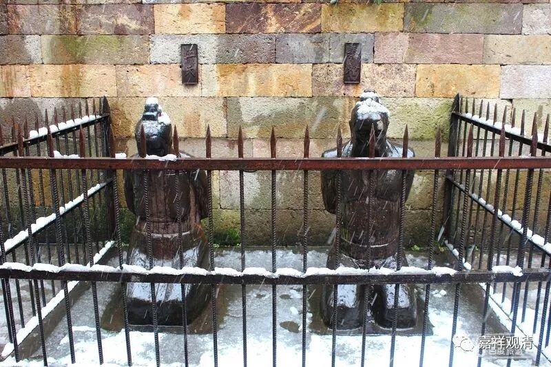

##  《菩提速道》090（三） 

关于贪呢，就是你觉得这东西很好，特别是 看到 它正面的 部分 ，你觉得很好，那你才会贪嘛。如果你看到了它的负面的东西，你真正想多了它的负面的东西，那你肯定不要了。比如说我的某个朋友就是，他非常喜欢吃生鱼片，在他喜欢吃的时候就觉得 “非常好吃”，对吧？等到你跟他讲吃生鱼片会有多少对健康有害的情况 （比如寄生虫） ，他突然之间就断除了吃生鱼片的习惯。贪，就是你觉得它的某一个方面特别好， 你就 想要 ……一旦拥有，慢慢 你发现了它的负面的地方， 越来越发觉 负面的地方难以接受， 慢慢你 就会不想要了 ……从贪爱走向了反面。 

**“九、嗔恚：**

**事、想、烦恼如恶语，动机希望殴打等。”**

就是你 想要 殴打啊 、 骂 啊 等等，都是希望让他受到伤害 。 这部分和前面的 “粗恶语”是一致的，所以说“**如粗恶语 ”**。 

**“加行：继续努力作嗔的思惟（令其强烈）。”**

加行、造作、方便（我也不知道用现代汉语怎么表达这里的 “加行”，原意是“加功用行”）呢，就是 不断 地 恨他 ，在思维层面不断地加强 。 从 “ 忿忿不平 ”到“恨之入骨”到“恼羞成怒”……

**“究竟：指决定打杀缚等。”**

圆满的嗔， 就是在心里面想 “ 我明天把他抓起来 ” ，或者 “ 我明天给他一 拳 ”。你甚至还想过 这一拳是怎样的组合拳，是先打左拳还是先打右拳 ， 然后再一个勾拳。 总之就是确定了要怎么伤害对方。 

嗔心是不是一定是针对有情的呢？单纯看这里的 “**决定打杀缚等**”似乎必须是有情而言的，但我们可以说，“等”字里面包含了非情。比如看着村口碍事的大树就不满意，看着岳坟前面跪着的那俩铁像就想动手砸……大学时候我去岳坟，就捡了块砖头……（不算破坏文物吧），去 南京中山陵在山上看到汪精卫的跪像也扔了俩石子 ……（现在已经挪走了。不知道是不是因为被我砸过，所以算是特别的文物而被保护起来了？） 

##  （岳坟前秦桧夫妇跪像，都已经是第好几版了） 

##  （挪走的汪精卫夫妇像） 

