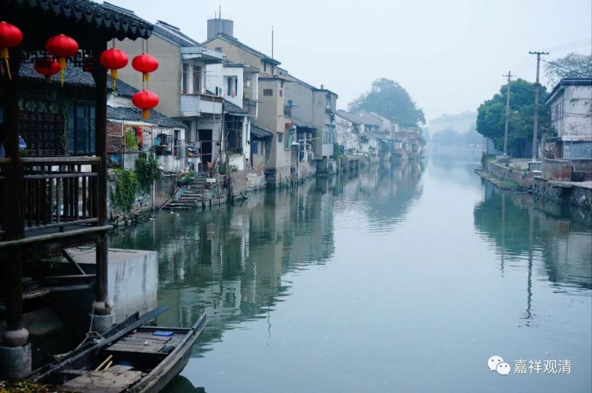

##  《菩提速道》090（四） 

**“癸二、白业道：”**

十个黑业的反面就是白业。 黑业就是恶业，白业就是善业。 

**“以断杀生这个善业为例，事为其他有情；意乐为见到过患希望断除；加行为努力防护杀生的行为；究竟指守护身业清净圆满。其他九种白业道也应当依此类推。”**

不杀生， 就是它是有防护杀业的作用，不仅仅是不去做杀业，而且是有防护的背景 —— 就是有它相 对治 的这个背景。 从这个角度讲，确实 “断杀业”更明白一些。 

其余九个白业按照这个对应黑业类推即可。 

**“癸三、开示造业的大力门：**

**由田故力大者：”**这个田就是指福田。造业的话 ， 哪些比较大呢？ 

**“指对于三宝、上师、父母等随作利益或损害之业，其力都极为强大。”**

就是说造业的对象在因果上的果报会比较厉害。 三宝、师长是出世间的福田，父母是世间的福田。在这些对象上作损益， 力量大，就是加分多。 

**“由意乐故力大者：由猛利的悲悯或极度的嗔恨而作的业，其力非常大。”**

这个是因为烦恼比较重，所以 造业 的力量比较大。 

**“由事物故力大者：法施或布施殊胜的财物，其力非常大。**

做的事情比较大、比较殊胜，那么加减分也比较多。 

**由所依故力大者：具有三种戒律者等，随作善恶，其力都非常强大。”**

比如说 ， 你拥有圆满的戒律，那么你所作的善的力量固然比较大，同时作恶的力量也很强大 ， 就是所作的罪可能比较大。 

